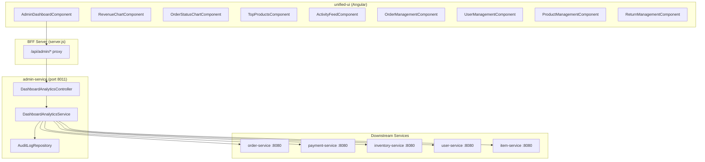

# Design Document: Admin Dashboard Analytics

## Overview

This design describes the architecture for adding comprehensive analytics capabilities to the MyIndianStore admin dashboard. The solution introduces a new `DashboardAnalyticsController` in the admin-service that aggregates data from five downstream microservices (order-service, payment-service, inventory-service, user-service, item-service) and exposes it through a set of REST endpoints. The Angular frontend receives a complete overhaul of the admin dashboard view, replacing placeholder cards with real-time KPI cards, time-series charts, distribution visualizations, top-products tables, activity feeds, and management sub-pages.

**Key Design Decisions:**
- **Aggregation at the admin-service**: The admin-service already has WebClient connectivity and JWT authentication. Adding aggregation here avoids introducing a new service and reuses the existing BFF proxy pattern.
- **Parallel WebClient calls with fallback**: Downstream calls use `Mono.zip` for concurrency with per-service fallback to default values, meeting the 5-second SLA.
- **Typed DTOs over raw JSON strings**: Unlike the existing ManagementController (which passes raw JSON strings), the analytics layer uses strongly-typed DTOs for compile-time safety and testability.
- **Angular standalone components with lazy-loaded child routes**: Sub-pages use the existing `AdminRoutingModule` with new child routes, keeping the bundle size manageable.

## Architecture



### Request Flow

1. Angular components call `/api/admin/dashboard/*` endpoints
2. BFF server proxies to admin-service on port 8011
3. `DashboardAnalyticsController` delegates to `DashboardAnalyticsService`
4. Service makes parallel WebClient calls to downstream services
5. Responses are aggregated into typed DTOs and returned
6. If a downstream service fails, default/empty values are returned with a warning

## Components and Interfaces

### Backend Components

#### DashboardAnalyticsController

```java
@RestController
@RequestMapping("/api/admin/dashboard")
@RequiredArgsConstructor
public class DashboardAnalyticsController {

    // GET /api/admin/dashboard/summary
    // Returns: DashboardSummaryDTO

    // GET /api/admin/dashboard/revenue?period={daily|weekly|monthly}
    // Returns: List<TimeSeriesEntryDTO>

    // GET /api/admin/dashboard/orders/status-distribution
    // Returns: List<StatusCountDTO>

    // GET /api/admin/dashboard/products/top-selling
    // Returns: List<TopProductDTO>

    // GET /api/admin/dashboard/activity-feed
    // Returns: List<ActivityFeedEntryDTO>
}
```

#### DashboardAnalyticsService

Responsible for orchestrating WebClient calls and aggregating results.

```java
@Service
public class DashboardAnalyticsService {

    // fetchDashboardSummary(): DashboardSummaryDTO
    //   - Calls order-service, user-service, item-service, inventory-service, payment-service in parallel
    //   - Applies fallback per service on failure
    //   - Combines into single DTO with warnings array

    // fetchRevenueTimeSeries(period: String): List<TimeSeriesEntryDTO>
    //   - Calls order-service for revenue data grouped by period

    // fetchOrderStatusDistribution(): List<StatusCountDTO>
    //   - Calls order-service for order count grouped by status

    // fetchTopSellingProducts(): List<TopProductDTO>
    //   - Calls order-service for top 10 products by quantity sold

    // fetchActivityFeed(): List<ActivityFeedEntryDTO>
    //   - Queries local AuditLogRepository for 20 most recent entries
}
```

#### Configuration Additions (application.yml)

```yaml
dashboard:
  low-stock-threshold: 10
  activity-feed-limit: 20
  top-products-limit: 10
  downstream-timeout-ms: 4000
```

### Frontend Components

#### AdminDashboardComponent (Enhanced)

The existing component is refactored to orchestrate sub-components:

| Component | Purpose |
|-----------|---------|
| `KpiCardsComponent` | Displays 4 KPI summary cards with loading skeletons |
| `RevenueChartComponent` | Line/bar chart with period selector (daily/weekly/monthly) |
| `OrderStatusChartComponent` | Pie/donut chart for order status distribution |
| `TopProductsTableComponent` | Ranked table of top 10 products |
| `LowStockAlertsComponent` | Warning list of low-stock inventory items |
| `ActivityFeedComponent` | Scrollable list of recent audit log entries |
| `QuickActionsComponent` | Navigation grid to management sub-pages |

#### Admin Sub-Page Components

| Route | Component | Purpose |
|-------|-----------|---------|
| `/admin/orders` | `OrderManagementComponent` | Paginated order table with detail view and status update |
| `/admin/users` | `UserManagementComponent` | Paginated user table with edit form |
| `/admin/products` | `ProductManagementComponent` | Paginated product table with edit form and stock management |
| `/admin/returns` | `ReturnManagementComponent` | Return request table with approve/reject actions |

#### AdminAnalyticsService (Angular)

```typescript
@Injectable({ providedIn: 'root' })
export class AdminAnalyticsService {
  getDashboardSummary(): Observable<DashboardSummary>;
  getRevenueTimeSeries(period: 'daily' | 'weekly' | 'monthly'): Observable<TimeSeriesEntry[]>;
  getOrderStatusDistribution(): Observable<StatusCount[]>;
  getTopSellingProducts(): Observable<TopProduct[]>;
  getActivityFeed(): Observable<ActivityFeedEntry[]>;
}
```

### API Contracts

#### GET /api/admin/dashboard/summary

```json
{
  "totalOrders": 1452,
  "totalRevenue": 2450000.00,
  "todayOrders": 23,
  "pendingOrders": 45,
  "totalUsers": 1250,
  "newUsersThisWeek": 18,
  "totalProducts": 89,
  "lowStockCount": 5,
  "paymentSuccessRate": 94.5,
  "totalRefunds": 12,
  "warnings": []
}
```

#### GET /api/admin/dashboard/revenue?period=daily

```json
[
  { "label": "2025-01-01", "value": 45000.00 },
  { "label": "2025-01-02", "value": 52000.00 }
]
```

#### GET /api/admin/dashboard/orders/status-distribution

```json
[
  { "status": "PENDING", "count": 45 },
  { "status": "CONFIRMED", "count": 120 },
  { "status": "SHIPPED", "count": 230 },
  { "status": "DELIVERED", "count": 1050 },
  { "status": "CANCELLED", "count": 7 }
]
```

#### GET /api/admin/dashboard/products/top-selling

```json
[
  {
    "productId": 12,
    "productName": "Basmati Rice 5kg",
    "totalQuantitySold": 450,
    "totalRevenue": 225000.00
  }
]
```

#### GET /api/admin/dashboard/activity-feed

```json
[
  {
    "adminUsername": "admin",
    "action": "UPDATE",
    "entityType": "ORDER",
    "entityId": "1045",
    "details": "Updated order status to SHIPPED",
    "timestamp": "2025-01-15T14:30:00"
  }
]
```

## Data Models

### Backend DTOs

```java
// DashboardSummaryDTO
@Data @Builder
public class DashboardSummaryDTO {
    private long totalOrders;
    private BigDecimal totalRevenue;
    private long todayOrders;
    private long pendingOrders;
    private long totalUsers;
    private long newUsersThisWeek;
    private long totalProducts;
    private long lowStockCount;
    private double paymentSuccessRate;
    private long totalRefunds;
    private List<String> warnings;
}

// TimeSeriesEntryDTO
@Data @AllArgsConstructor
public class TimeSeriesEntryDTO {
    private String label;  // date string
    private BigDecimal value;  // revenue amount
}

// StatusCountDTO
@Data @AllArgsConstructor
public class StatusCountDTO {
    private String status;
    private long count;
}

// TopProductDTO
@Data @AllArgsConstructor
public class TopProductDTO {
    private Long productId;
    private String productName;
    private long totalQuantitySold;
    private BigDecimal totalRevenue;
}

// ActivityFeedEntryDTO
@Data @AllArgsConstructor
public class ActivityFeedEntryDTO {
    private String adminUsername;
    private String action;
    private String entityType;
    private String entityId;
    private String details;
    private LocalDateTime timestamp;
}
```

### Frontend Interfaces

```typescript
interface DashboardSummary {
  totalOrders: number;
  totalRevenue: number;
  todayOrders: number;
  pendingOrders: number;
  totalUsers: number;
  newUsersThisWeek: number;
  totalProducts: number;
  lowStockCount: number;
  paymentSuccessRate: number;
  totalRefunds: number;
  warnings: string[];
}

interface TimeSeriesEntry {
  label: string;
  value: number;
}

interface StatusCount {
  status: string;
  count: number;
}

interface TopProduct {
  productId: number;
  productName: string;
  totalQuantitySold: number;
  totalRevenue: number;
}

interface ActivityFeedEntry {
  adminUsername: string;
  action: string;
  entityType: string;
  entityId: string;
  details: string;
  timestamp: string;
}
```


## Correctness Properties

*A property is a characteristic or behavior that should hold true across all valid executions of a system — essentially, a formal statement about what the system should do. Properties serve as the bridge between human-readable specifications and machine-verifiable correctness guarantees.*

### Property 1: Summary aggregation preserves downstream field values

*For any* valid order-service response containing totalOrders, totalRevenue, todayOrders, and pendingOrders, and *for any* valid user-service response containing totalUsers and newUsersThisWeek, the aggregation function SHALL produce a DashboardSummaryDTO where those fields exactly match the corresponding values from the downstream responses.

**Validates: Requirements 1.1, 1.2**

### Property 2: Low stock count equals items below threshold

*For any* set of inventory items with varying available quantities, and *for any* configurable low-stock threshold > 0, the `lowStockCount` field in the DashboardSummaryDTO SHALL equal the number of items whose available quantity is strictly less than the threshold.

**Validates: Requirements 1.3**

### Property 3: Payment success rate calculation correctness

*For any* set of payment records containing successful and failed payments where total payments > 0, the `paymentSuccessRate` field in the DashboardSummaryDTO SHALL equal `(successfulPayments / totalPayments) * 100`, rounded to one decimal place.

**Validates: Requirements 1.4**

### Property 4: Graceful degradation returns partial data with warnings

*For any* subset of downstream services that are unreachable (including the empty set and the full set), the aggregation function SHALL return a DashboardSummaryDTO where: (a) fields belonging to failed services have their defined default values (0 for counts, 0.0 for rates), (b) fields belonging to successful services retain their correct aggregated values, and (c) the warnings array contains exactly one entry per failed service.

**Validates: Requirements 1.5**

### Property 5: Time-series output has correct entry count per period

*For any* valid period parameter in {"daily", "weekly", "monthly"} and *for any* set of order revenue data, the time-series function SHALL return exactly 30 entries for "daily", 12 entries for "weekly", and 12 entries for "monthly", where each entry has a non-null label string and a non-negative revenue value.

**Validates: Requirements 2.1, 2.2, 2.3, 2.4**

### Property 6: Order status distribution sum equals total orders

*For any* list of orders with assigned statuses, the order status distribution function SHALL produce a list of StatusCountDTO objects where the sum of all `count` values equals the total number of input orders, each `status` field is non-null and non-empty, and each `count` is non-negative.

**Validates: Requirements 3.1, 3.2**

### Property 7: Top products are sorted descending by quantity and capped at 10

*For any* set of product sales data with N products (N ≥ 0), the top-selling products function SHALL return min(N, 10) entries sorted in strictly non-increasing order by `totalQuantitySold`, where each entry contains non-null productId, productName, non-negative totalQuantitySold, and non-negative totalRevenue.

**Validates: Requirements 4.1, 4.2**

### Property 8: Activity feed is ordered by timestamp descending and limited to 20

*For any* set of M audit log entries (M ≥ 0), the activity feed function SHALL return min(M, 20) entries where timestamps are in non-increasing order, and each entry's adminUsername, action, entityType, entityId, details, and timestamp fields match the corresponding source AuditLog entity fields exactly.

**Validates: Requirements 5.1, 5.2**

## Error Handling

### Backend Error Handling Strategy

| Scenario | Behavior |
|----------|----------|
| Single downstream service timeout/error | Return partial data with defaults for that service; add service name to `warnings` array |
| All downstream services fail | Return all-defaults DTO with all service names in `warnings` |
| Invalid `period` parameter | Return 400 Bad Request with descriptive error message |
| Authentication failure (no/invalid JWT) | Return 401 Unauthorized (handled by existing SecurityConfig) |
| Internal aggregation error | Return 500 Internal Server Error with generic message; log details |

**WebClient Timeout Configuration:**
- Per-service timeout: 4000ms (configurable via `dashboard.downstream-timeout-ms`)
- Overall endpoint timeout: 5000ms (enforced via `Mono.timeout`)
- Uses `onErrorResume` per service call to provide fallback values

**Default Values for Failed Services:**
| Service | Default Values |
|---------|---------------|
| order-service | totalOrders=0, totalRevenue=0.00, todayOrders=0, pendingOrders=0 |
| user-service | totalUsers=0, newUsersThisWeek=0 |
| item-service | totalProducts=0 |
| inventory-service | lowStockCount=0 |
| payment-service | paymentSuccessRate=0.0, totalRefunds=0 |

### Frontend Error Handling Strategy

| Scenario | Behavior |
|----------|----------|
| API returns partial data with warnings | Display available data; show warning toast for failed services |
| API request timeout/network error | Show error state with retry button; hide loading skeletons |
| Chart data empty | Show "No data available" message in chart area |
| Sub-page API failure | Show error banner above table with retry option |
| Form submission fails | Show inline validation errors or toast notification |

## Testing Strategy

### Backend Testing

**Unit Tests (JUnit 5 + Mockito):**
- `DashboardAnalyticsService` tested with mocked WebClient responses
- Each aggregation method tested with representative examples
- Error/fallback paths tested per service
- DTO mapping from raw JSON to typed objects

**Property-Based Tests (jqwik):**
- Use [jqwik](https://jqwik.net/) library for property-based testing in Java
- Minimum 100 iterations per property test
- Test the pure aggregation/transformation logic with generated inputs
- Mock WebClient responses with arbitrary valid JSON payloads
- Each property test tagged with: `@Tag("Feature: admin-dashboard-analytics, Property {N}: {title}")`

**Properties to implement as PBT:**
1. Summary aggregation field preservation (Property 1)
2. Low stock threshold counting (Property 2)
3. Payment success rate calculation (Property 3)
4. Graceful degradation with partial failures (Property 4)
5. Time-series entry count per period (Property 5)
6. Status distribution sum invariant (Property 6)
7. Top products sort and cap invariant (Property 7)
8. Activity feed ordering and field mapping (Property 8)

**Integration Tests (Spring Boot Test):**
- Full controller tests with `@WebMvcTest` verifying authentication, HTTP status codes, and response structure
- End-to-end tests with `@SpringBootTest` against test containers for PostgreSQL

### Frontend Testing

**Unit Tests (Jasmine + Angular TestBed):**
- Component tests for each dashboard sub-component
- Service tests with mocked HttpClient
- Route navigation tests

**E2E Tests (optional, Cypress/Playwright):**
- Dashboard loads and displays KPI cards
- Chart interactions (period switching)
- Sub-page navigation and CRUD operations

### Test Dependencies

**Backend (add to pom.xml):**
```xml
<dependency>
    <groupId>net.jqwik</groupId>
    <artifactId>jqwik</artifactId>
    <version>1.8.2</version>
    <scope>test</scope>
</dependency>
```

**Frontend:**
- Angular testing utilities (already included via `@angular/core/testing`)
- Chart library testing: mock chart instances in unit tests
