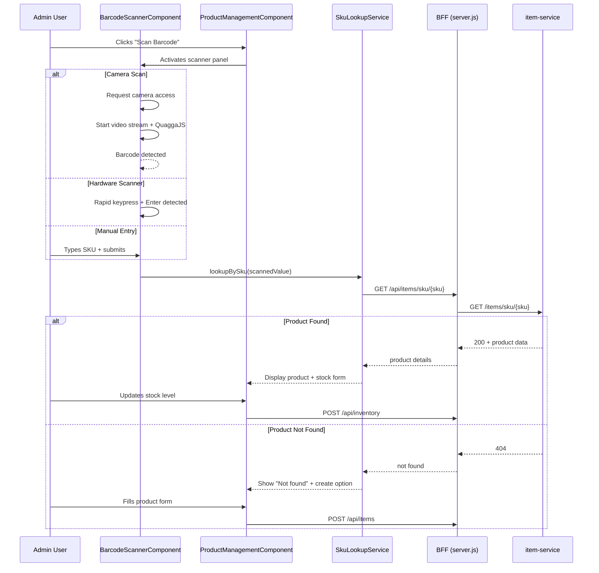

# Design Document: Barcode Scan Product

## Overview

This feature adds barcode scanning capabilities to the existing admin product management page (`/admin/products`) in the MyIndianStore unified-ui. The scanner component supports three input modes: camera-based scanning using a JavaScript barcode detection library, hardware USB/Bluetooth barcode scanner input via keypress event buffering, and manual SKU entry. Upon scanning, the system performs a product lookup via the existing `GET /items/sku/{sku}` endpoint on item-service. Found products display an inline stock update form; unfound barcodes offer a new product creation flow.

### Key Design Decisions

1. **Library choice**: Use `@ArdaOzcan/barcode-reader` or `quagga2` (QuaggaJS v2) for camera-based barcode decoding — both support EAN-13, EAN-8, UPC-A, UPC-E, and Code 128 with active maintenance. We select **QuaggaJS 2** for its mature Angular community usage and comprehensive format support.
2. **Standalone component architecture**: The barcode scanner will be a standalone Angular component (`BarcodeScannerComponent`) following the existing pattern in the project where admin sub-pages are standalone components with lazy-loaded routes.
3. **BFF proxy route**: Add a new `/api/items/sku/:sku` endpoint in `server.js` that proxies to item-service's existing `GET /items/sku/{sku}`.
4. **Hardware scanner detection**: Use keypress timing heuristic — if characters arrive faster than 50ms apart and end with Enter, treat as hardware scanner input rather than manual typing.
5. **No new backend changes needed**: Item-service already has the `GET /items/sku/{sku}` endpoint and `POST /items` for creation. Inventory updates go through the existing BFF `/api/inventory` endpoint.

## Architecture

```mermaid
graph TB
    subgraph "unified-ui (Angular 18 Frontend)"
        PM[ProductManagementComponent]
        BS[BarcodeScannerComponent]
        SL[SkuLookupService]
        PM --> BS
        BS --> SL
    end

    subgraph "BFF (server.js - Express)"
        BFF_SKU[GET /api/items/sku/:sku]
        BFF_ITEMS[POST /api/items]
        BFF_INV[POST /api/inventory]
    end

    subgraph "Backend Services"
        IS[item-service :8005]
        INV[inventory-service :8003]
        AS[admin-service :8011]
    end

    SL -->|HTTP| BFF_SKU
    SL -->|HTTP| BFF_ITEMS
    SL -->|HTTP| BFF_INV

    BFF_SKU -->|GET /items/sku/{sku}| IS
    BFF_ITEMS -->|POST /api/manage/items| AS
    BFF_INV -->|POST /api/manage/inventory| AS
    AS -->|forwards| IS
    AS -->|forwards| INV
```

### Component Interaction Flow



## Components and Interfaces

### 1. BarcodeScannerComponent (Angular Standalone)

**Location**: `src/app/features/admin/components/barcode-scanner/`

**Responsibilities**:
- Manage camera lifecycle (request access, display preview, stop stream)
- Configure and run QuaggaJS for camera-based barcode decoding
- Detect hardware scanner input via keypress timing heuristic
- Provide manual SKU entry input field
- Emit scanned barcode values to parent component
- Display scanner status (active/inactive indicator)
- Provide visual/audio feedback on successful scan

**Interface**:
```typescript
@Component({
  selector: 'app-barcode-scanner',
  standalone: true,
  imports: [CommonModule, FormsModule],
})
export class BarcodeScannerComponent implements OnInit, OnDestroy {
  @Output() barcodeScanned = new EventEmitter<string>();
  @Output() scannerError = new EventEmitter<string>();
  @Input() isActive: boolean = false;

  scannerState: 'idle' | 'active' | 'error' = 'idle';
  cameraPermissionDenied: boolean = false;
  manualSkuValue: string = '';
  
  activateCamera(): void;
  deactivateCamera(): void;
  onManualSubmit(): void;
}
```

### 2. SkuLookupService (Angular Injectable)

**Location**: `src/app/features/admin/services/sku-lookup.service.ts`

**Responsibilities**:
- Call BFF endpoint for SKU-based product lookup
- Call BFF endpoint for product creation
- Call BFF endpoint for stock level update
- Handle HTTP error responses and map to typed results

**Interface**:
```typescript
@Injectable({ providedIn: 'root' })
export class SkuLookupService {
  lookupBySku(sku: string): Observable<ProductLookupResult>;
  createProduct(product: CreateProductRequest): Observable<ProductDetails>;
  updateStock(itemId: number, sku: string, quantity: number): Observable<void>;
}

interface ProductLookupResult {
  found: boolean;
  product?: ProductDetails;
  error?: string;
}

interface ProductDetails {
  id: number;
  sku: string;
  name: string;
  description: string;
  price: number;
  quantity: number;
  itemType?: string;
}

interface CreateProductRequest {
  sku: string;
  name: string;
  description: string;
  price: number;
  quantity: number;
}
```

### 3. BFF Route Addition (server.js)

**New endpoint**: `GET /api/items/sku/:sku`

```javascript
// SKU lookup - admin authenticated
app.get('/api/items/sku/:sku', authenticateAdmin, async (req, res) => {
  try {
    const response = await axios.get(`${ITEM_SERVICE}/items/sku/${req.params.sku}`);
    res.json(response.data);
  } catch (e) {
    res.status(e.response?.status || 500).json({ error: 'SKU lookup failed' });
  }
});
```

### 4. ProductManagementComponent (Enhanced)

**Changes to existing component**:
- Add scanner panel section above the product table
- Add scanner toggle button in header
- Add product lookup result display section
- Add inline stock update form
- Add new product creation form (pre-filled SKU)
- Integrate `BarcodeScannerComponent` and `SkuLookupService`

### 5. Hardware Scanner Detection Logic

**Algorithm**:
```
BUFFER = []
LAST_KEYPRESS_TIME = 0
RAPID_THRESHOLD = 50ms  // max time between keypresses for hardware scanner
MIN_LENGTH = 3          // minimum barcode length

on keypress(event):
  current_time = now()
  
  if event.key == 'Enter':
    if BUFFER.length >= MIN_LENGTH:
      emit barcodeScanned(BUFFER.join(''))
    BUFFER = []
    return
  
  if current_time - LAST_KEYPRESS_TIME > RAPID_THRESHOLD:
    BUFFER = []  // too slow, reset (manual typing)
  
  BUFFER.push(event.key)
  LAST_KEYPRESS_TIME = current_time
```

## Data Models

### Frontend Models

```typescript
// Scanner state
interface ScannerState {
  isActive: boolean;
  mode: 'camera' | 'hardware' | 'manual' | 'idle';
  lastScannedValue: string | null;
  lastScanTime: Date | null;
}

// Product lookup result
interface ProductLookupResult {
  found: boolean;
  product?: ProductDetails;
  error?: string;
}

// Product details (maps to item-service ItemResponse)
interface ProductDetails {
  id: number;
  sku: string;
  name: string;
  description: string;
  price: number;
  quantity: number;  // stock level from item entity
  itemType?: string;
  createdAt?: string;
  updatedAt?: string;
}

// Stock update request
interface StockUpdateRequest {
  itemId: number;
  sku: string;
  availableQuantity: number;
}

// New product creation form
interface CreateProductForm {
  sku: string;       // pre-filled from scan, non-editable
  name: string;
  description: string;
  price: number | null;
  quantity: number | null;
}

// Validation result
interface ValidationResult {
  valid: boolean;
  errors: { [field: string]: string };
}
```

### Backend Models (Existing - No Changes)

The item-service `Item` entity already has all required fields:
- `id` (Long, auto-generated)
- `sku` (String, unique)
- `name` (String, required)
- `description` (String, optional)
- `price` (BigDecimal, required)
- `quantity` (Integer, required)
- `itemType` (String, optional)

The inventory-service `InventoryItem` entity provides:
- `sku` (String)
- `quantity` (Integer)

## Correctness Properties

*A property is a characteristic or behavior that should hold true across all valid executions of a system — essentially, a formal statement about what the system should do. Properties serve as the bridge between human-readable specifications and machine-verifiable correctness guarantees.*

### Property 1: Hardware scanner barcode capture correctness

*For any* alphanumeric string of length ≥ 3 emitted as rapid keypress events (inter-key delay < 50ms) followed by an Enter key, the hardware scanner detection logic SHALL capture and emit a value exactly equal to the concatenation of those keypress characters.

**Validates: Requirements 1.3**

### Property 2: Product details display completeness

*For any* valid product object returned from the SKU lookup (with non-empty name, SKU, valid price, description, and quantity), the product display component SHALL render all of these fields such that each field's value is present in the rendered output.

**Validates: Requirements 2.3**

### Property 3: Stock level input validation

*For any* numeric input value, the stock update form validation SHALL accept the value if and only if it is a non-negative integer (≥ 0, no decimals). All other values (negative numbers, decimals, empty, non-numeric) SHALL be rejected.

**Validates: Requirements 3.3**

### Property 4: Product creation form validation

*For any* combination of form field values (sku, name, price, quantity), the product creation form validation SHALL pass if and only if: SKU is a non-empty string, name is a non-empty string, price is a number ≥ 0, and quantity is a non-negative integer. All other combinations SHALL be rejected with appropriate field-level error messages.

**Validates: Requirements 4.2, 4.6**

## Error Handling

| Scenario | Handling | User Feedback |
|----------|----------|---------------|
| Camera access denied | Set `cameraPermissionDenied = true`, do not retry | Display message: "Camera access denied. Use manual entry or hardware scanner." |
| Camera not available (no device) | Catch `NotFoundError` from getUserMedia | Display message: "No camera found. Use manual entry or hardware scanner." |
| QuaggaJS initialization failure | Log error, fall back to manual mode | Display message: "Camera scanner unavailable. Use manual entry." |
| SKU lookup network error | Catch HTTP error, display retry option | "Lookup failed. Check your connection and try again." + Retry button |
| SKU lookup 404 | Map to "not found" state | "No product found for SKU: {value}." + "Create New Product" button |
| SKU lookup 500 | Map to error state | "Server error during lookup. Please try again." + Retry button |
| Stock update failure | Retain form values, show error | "Failed to update stock. Please try again." (form values preserved) |
| Product creation 409 (duplicate SKU) | Map to duplicate state | "SKU already exists. Would you like to look it up?" + Lookup button |
| Product creation validation error | Prevent submission, show field errors | Inline field-level validation messages |
| Navigation away while camera active | `ngOnDestroy` stops camera stream | None (cleanup is automatic) |
| Hardware scanner buffer overflow | Limit buffer to 128 characters | Silently discard oldest characters |

### Error Recovery Strategy

- All network errors display a retry button that re-executes the failed operation
- Form errors are non-destructive — user input is preserved across failures
- Camera errors gracefully degrade to manual entry mode
- The scanner component remains active after errors to allow the next scan

## Testing Strategy

### Unit Tests (Jasmine/Karma)

- **BarcodeScannerComponent**: Test camera activation/deactivation, manual submit, event emission, cleanup on destroy
- **Hardware scanner detection**: Test keypress timing logic, buffer management, Enter key triggering
- **SkuLookupService**: Test HTTP calls with mocked HttpClient, error mapping
- **ProductManagementComponent (enhanced)**: Test scanner toggle, lookup result display, stock form, creation form
- **Form validation**: Test stock validation and product creation form validation rules

### Property-Based Tests (fast-check)

The project already includes `fast-check` (v3.19.0) as a dev dependency.

- **Property 1 (Hardware scanner capture)**: Generate random alphanumeric strings of length 3-50, simulate rapid keypress events, assert captured value equals generated string. Minimum 100 iterations.
  - Tag: `Feature: barcode-scan-product, Property 1: Hardware scanner barcode capture correctness`
  
- **Property 2 (Product display completeness)**: Generate random valid product objects (arbitrary strings for name/sku/description, positive numbers for price, non-negative integers for quantity), render with the component, assert all field values appear in output. Minimum 100 iterations.
  - Tag: `Feature: barcode-scan-product, Property 2: Product details display completeness`

- **Property 3 (Stock validation)**: Generate arbitrary numbers (integers, decimals, negatives, zero), run through validation function, assert it passes iff value is a non-negative integer. Minimum 100 iterations.
  - Tag: `Feature: barcode-scan-product, Property 3: Stock level input validation`

- **Property 4 (Creation form validation)**: Generate arbitrary form data (mix of empty/non-empty strings, positive/negative/decimal numbers), run through validation, assert it passes iff all constraints simultaneously satisfied. Minimum 100 iterations.
  - Tag: `Feature: barcode-scan-product, Property 4: Product creation form validation`

### Integration Tests

- BFF route `/api/items/sku/:sku` correctly proxies to item-service
- End-to-end scanner → lookup → display flow
- End-to-end scanner → not found → create flow
- Stock update through BFF to inventory-service

### Manual Testing

- Camera scanning with physical barcodes (EAN-13, UPC-A, Code 128)
- Hardware USB scanner device testing
- Layout verification: scanner panel doesn't disrupt product table
- Continuous scanning mode across multiple products
