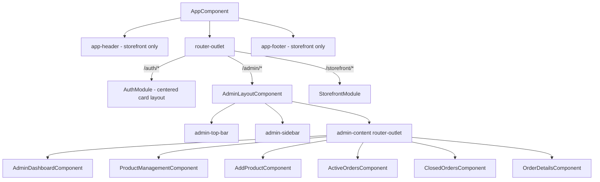
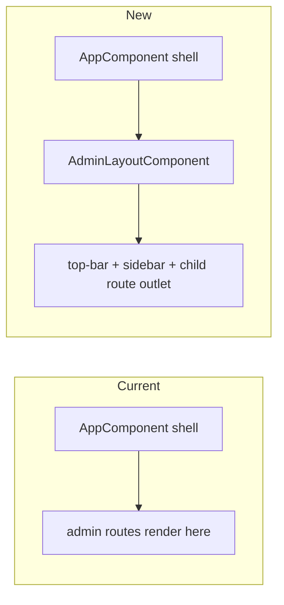
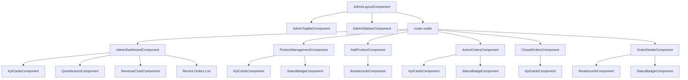

# Design Document: Maacko-Style UI Redesign

## Overview

This design transforms the MyIndianStore admin section from a top-navigation-only layout to a hybrid top-bar + left-sidebar navigation pattern inspired by Amazon Seller Central (Maacko style). Authentication pages (Login, Registration) are redesigned with a centered card layout on a gradient background. The storefront header and customer-facing pages remain unchanged.

The redesign introduces:
- An **AdminLayoutComponent** shell that wraps all `/admin/*` routes with a dedicated top bar and collapsible left sidebar
- Redesigned **auth pages** (Login, Registration) with icon-prefixed fields, OTP verification, and modern card styling
- New admin pages: Add Product, Active Orders, Closed Orders, Order Details
- Enhanced existing admin pages: Dashboard, Product Management
- Extended design system tokens for sidebar, status badges, and auth card styles

### Key Design Decisions

| Decision | Choice | Rationale |
|----------|--------|-----------|
| Admin shell approach | New `AdminLayoutComponent` wrapping child routes | Isolates admin layout from storefront without modifying `app.component.html` |
| Sidebar persistence | CSS Grid layout with fixed sidebar column | No JavaScript-based positioning; smooth collapse via CSS transitions |
| Admin top bar | Separate from storefront `AppHeaderComponent` | Admin bar has different content (no search, no cart); avoids growing conditional logic |
| Auth pages | Restyle existing components in-place | Auth module is small and self-contained; no routing changes needed |
| Component pattern | Standalone components for new pages; NgModule for layout shell | Consistent with existing admin routing pattern (`loadComponent`) |

## Architecture

### High-Level Layout Architecture



### Routing Architecture Change

Currently, admin routes render inside `app.component.html` alongside the storefront header/footer. The redesign introduces an intermediate layout component:



**Implementation**: The admin route in `app-routing.module.ts` loads `AdminLayoutComponent` as the parent, which provides its own `<router-outlet>` for child pages. The storefront `app-header` and `app-footer` are hidden when on admin routes using a CSS class on `<body>` or conditional rendering via route data.

### Admin Layout Grid

```
┌─────────────────────────────────────────────────────────┐
│  Admin Top Bar (logo, store name, notifications, profile)│
├──────────┬──────────────────────────────────────────────┤
│          │                                              │
│  Sidebar │           Content Area                       │
│  (nav)   │           (child router-outlet)              │
│          │                                              │
│          │                                              │
│          │                                              │
│          │                                              │
│          │                                              │
├──────────┴──────────────────────────────────────────────┤
```

CSS Grid definition:
```scss
.admin-layout {
  display: grid;
  grid-template-rows: 60px 1fr;
  grid-template-columns: var(--mis-sidebar-width) 1fr;
  grid-template-areas:
    "topbar topbar"
    "sidebar content";
  min-height: 100vh;
}
```

## Components and Interfaces

### New Components

| Component | Type | Location | Purpose |
|-----------|------|----------|---------|
| `AdminLayoutComponent` | Standalone | `features/admin/layout/` | Shell with top-bar, sidebar, content outlet |
| `AdminTopBarComponent` | Standalone | `features/admin/layout/admin-top-bar/` | Horizontal bar with logo, store name, notifications, profile dropdown |
| `AdminSidebarComponent` | Standalone | `features/admin/layout/admin-sidebar/` | Collapsible left nav with icon-labeled menu items |
| `AddProductComponent` | Standalone | `features/admin/pages/add-product/` | Multi-section product creation form |
| `ActiveOrdersComponent` | Standalone | `features/admin/pages/active-orders/` | In-progress orders list with expandable details |
| `ClosedOrdersComponent` | Standalone | `features/admin/pages/closed-orders/` | Delivered/cancelled orders with dual tables |
| `OrderDetailsComponent` | Standalone | `features/admin/pages/order-details/` | Full-page order view with timeline |
| `StatusBadgeComponent` | Standalone | `features/admin/components/status-badge/` | Reusable colored status indicator |
| `BreadcrumbComponent` | Standalone | `features/admin/components/breadcrumb/` | Route-based breadcrumb navigation |

### Modified Components

| Component | Changes |
|-----------|---------|
| `LoginComponent` | New template with Auth_Card, icon-prefixed inputs, password toggle, divider, cancel button |
| `RegisterComponent` | New template with OTP verification fields, gender dropdown, verify buttons with timers |
| `AdminDashboardComponent` | Add welcome greeting, restructure to match Maacko card layout, add recent orders list |
| `ProductManagementComponent` | Add KPI cards row, search/filter bar, redesigned table with status badges and action icons |
| `AppHeaderComponent` | Hide admin row 2 nav (sidebar replaces it); conditionally hide entire header on admin routes |
| `AppComponent` | Add route-based class to hide storefront header/footer on admin routes |

### Component Hierarchy



### AdminSidebarComponent Interface

```typescript
// admin-sidebar.component.ts
@Component({
  selector: 'app-admin-sidebar',
  standalone: true,
  imports: [CommonModule, RouterModule],
  templateUrl: './admin-sidebar.component.html',
  styleUrls: ['./admin-sidebar.component.scss']
})
export class AdminSidebarComponent {
  @Input() collapsed = false;
  @Output() collapsedChange = new EventEmitter<boolean>();
  @Output() logoutClicked = new EventEmitter<void>();

  menuItems: SidebarMenuItem[] = [
    { label: 'Dashboard', icon: 'dashboard', route: '/admin' },
    { label: 'Add Product', icon: 'add_box', route: '/admin/products/add' },
    { label: 'Manage Products', icon: 'inventory', route: '/admin/products' },
    { label: 'Active Orders', icon: 'pending_actions', route: '/admin/orders/active' },
    { label: 'Closed Orders', icon: 'check_circle', route: '/admin/orders/closed' },
    { label: 'Categories', icon: 'category', route: '/admin/categories' },
    { label: 'Reviews', icon: 'rate_review', route: '/admin/reviews' },
    { label: 'Earnings', icon: 'account_balance', route: '/admin/earnings' },
    { label: 'Payouts', icon: 'payments', route: '/admin/payouts' },
    { label: 'Store Settings', icon: 'settings', route: '/admin/settings' },
    { label: 'Profile', icon: 'person', route: '/admin/profile' },
  ];

  toggleCollapse(): void { ... }
  onLogout(): void { ... }
}

interface SidebarMenuItem {
  label: string;
  icon: string;
  route: string;
}
```

### AdminTopBarComponent Interface

```typescript
@Component({
  selector: 'app-admin-top-bar',
  standalone: true,
  imports: [CommonModule, RouterModule],
  templateUrl: './admin-top-bar.component.html',
  styleUrls: ['./admin-top-bar.component.scss']
})
export class AdminTopBarComponent {
  @Input() userName = '';
  @Input() storeName = 'myindianstore';
  @Output() sidebarToggle = new EventEmitter<void>();
  @Output() logoutClicked = new EventEmitter<void>();

  notificationCount = 0;
  profileDropdownOpen = false;

  toggleProfileDropdown(): void { ... }
  onNotificationsClick(): void { ... }
}
```

### StatusBadgeComponent Interface

```typescript
@Component({
  selector: 'app-status-badge',
  standalone: true,
  imports: [CommonModule],
  template: `
    <span class="status-badge status-badge--{{ variant }}"
          [attr.aria-label]="label + ' status: ' + text">
      {{ text }}
    </span>
  `,
  styleUrls: ['./status-badge.component.scss']
})
export class StatusBadgeComponent {
  @Input() text = '';
  @Input() variant: StatusVariant = 'default';
  @Input() label = 'Item';
}

type StatusVariant =
  | 'active' | 'inactive'
  | 'in-stock' | 'low-stock' | 'out-of-stock'
  | 'pending' | 'confirmed' | 'shipped' | 'delivered' | 'cancelled'
  | 'default';
```

### AdminLayoutComponent Interface

```typescript
@Component({
  selector: 'app-admin-layout',
  standalone: true,
  imports: [
    CommonModule, RouterModule,
    AdminTopBarComponent, AdminSidebarComponent
  ],
  templateUrl: './admin-layout.component.html',
  styleUrls: ['./admin-layout.component.scss']
})
export class AdminLayoutComponent implements OnInit {
  sidebarCollapsed = false;
  currentUser: AuthUser | null = null;

  constructor(
    private authService: AuthService,
    private router: Router
  ) {}

  onSidebarToggle(): void { ... }
  onLogout(): void { ... }
}
```

### Routing Changes

```typescript
// Updated admin-routing.module.ts
const routes: Routes = [
  {
    path: '',
    component: AdminLayoutComponent, // New parent layout
    children: [
      { path: '', component: AdminDashboardComponent },
      { path: 'products', loadComponent: () => import('./pages/product-management/product-management.component').then(m => m.ProductManagementComponent) },
      { path: 'products/add', loadComponent: () => import('./pages/add-product/add-product.component').then(m => m.AddProductComponent) },
      { path: 'orders/active', loadComponent: () => import('./pages/active-orders/active-orders.component').then(m => m.ActiveOrdersComponent) },
      { path: 'orders/closed', loadComponent: () => import('./pages/closed-orders/closed-orders.component').then(m => m.ClosedOrdersComponent) },
      { path: 'orders/:id', loadComponent: () => import('./pages/order-details/order-details.component').then(m => m.OrderDetailsComponent) },
      // Legacy routes redirect for backward compatibility
      { path: 'orders', redirectTo: 'orders/active', pathMatch: 'full' },
      { path: 'users', loadComponent: () => import('./pages/user-management/user-management.component').then(m => m.UserManagementComponent) },
      { path: 'returns', loadComponent: () => import('./pages/return-management/return-management.component').then(m => m.ReturnManagementComponent) },
    ]
  }
];
```

### Storefront Header Visibility Strategy

The `AppComponent` will conditionally hide the storefront header and footer when the route is under `/admin`:

```typescript
// app.component.ts
export class AppComponent implements OnInit {
  showStorefrontShell = true;

  constructor(private router: Router) {}

  ngOnInit(): void {
    this.router.events.pipe(
      filter(event => event instanceof NavigationEnd)
    ).subscribe((event: NavigationEnd) => {
      this.showStorefrontShell = !event.urlAfterRedirects.startsWith('/admin');
    });
  }
}
```

```html
<!-- app.component.html -->
<app-header *ngIf="showStorefrontShell"></app-header>
<main class="main-content" [class.admin-active]="!showStorefrontShell">
  <router-outlet></router-outlet>
</main>
<app-footer *ngIf="showStorefrontShell"></app-footer>
```

## Data Models

### Sidebar Menu Item Model

```typescript
export interface SidebarMenuItem {
  label: string;
  icon: string;
  route: string;
  badge?: number;        // Optional notification count
  children?: SidebarMenuItem[]; // Future: sub-menus
}
```

### Status Badge Model

```typescript
export type StatusVariant =
  | 'active' | 'inactive'
  | 'in-stock' | 'low-stock' | 'out-of-stock'
  | 'pending' | 'confirmed' | 'shipped' | 'delivered' | 'cancelled'
  | 'default';

export interface StatusBadgeConfig {
  text: string;
  variant: StatusVariant;
  ariaLabel?: string;
}
```

### Order Models (for Active/Closed/Details pages)

```typescript
export interface OrderListItem {
  orderId: string;
  productName: string;
  productImage: string;
  productSku: string;
  quantity: number;
  customerName: string;
  customerPhone: string;
  amount: number;
  paymentMethod: string;
  orderDate: string;
  status: OrderStatus;
}

export type OrderStatus = 'pending' | 'confirmed' | 'shipped' | 'out-for-delivery' | 'delivered' | 'cancelled';

export interface OrderDetails extends OrderListItem {
  customerEmail: string;
  deliveryAddress: string;
  expectedDelivery: string;
  courierPartner: string;
  trackingId: string;
  category: string;
  brand: string;
  unitPrice: number;
  subtotal: number;
  shipping: number;
  tax: number;
  grandTotal: number;
  paymentStatus: string;
  timeline: OrderTimelineStep[];
}

export interface OrderTimelineStep {
  stage: string;
  date?: string;
  completed: boolean;
  current: boolean;
}
```

### Product Form Model (Add Product)

```typescript
export interface ProductFormData {
  // Basic Information
  name: string;
  sku: string;
  category: string;
  subCategory: string;
  brand: string;

  // Pricing & Stock
  price: number;
  compareAtPrice?: number;
  costPrice?: number;
  stockQuantity: number;
  lowStockAlert: number;
  stockStatus: 'in-stock' | 'low-stock' | 'out-of-stock';

  // Description
  shortDescription: string;
  fullDescription: string;

  // Images
  images: ProductImage[];

  // Other Information
  weight?: number;
  dimensions?: { length: number; width: number; height: number };
  tags: string[];
  status: 'active' | 'draft';
}

export interface ProductImage {
  file?: File;
  url: string;
  isPrimary: boolean;
}
```

### KPI Card Model (Reused)

```typescript
export interface KpiCardData {
  label: string;
  value: string | number;
  icon?: string;
  trend?: { direction: 'up' | 'down' | 'neutral'; percentage: number };
  color?: string;
}
```

### SCSS Architecture Extensions

New design tokens added to `_variables.scss`:

```scss
// Admin Layout Tokens
--mis-sidebar-width:         250px;
--mis-sidebar-width-collapsed: 64px;
--mis-sidebar-bg:            #1A1A2E;
--mis-sidebar-text:          #CCCCCC;
--mis-sidebar-active-bg:     #FF6B35;
--mis-sidebar-active-text:   #FFFFFF;
--mis-sidebar-hover-bg:      #2A2A4A;
--mis-admin-topbar-height:   60px;
--mis-admin-content-padding: 24px;

// Auth Card Tokens
--mis-auth-card-bg:          #FFFFFF;
--mis-auth-card-radius:      16px;
--mis-auth-card-shadow:      0 8px 32px rgba(0, 0, 0, 0.12);
--mis-auth-card-padding:     40px;
--mis-auth-gradient-start:   #667eea;
--mis-auth-gradient-end:     #764ba2;
```

### BEM Naming Structure

```
.admin-layout
  .admin-layout__topbar
  .admin-layout__sidebar
  .admin-layout__content

.admin-sidebar
  .admin-sidebar__header
  .admin-sidebar__menu
  .admin-sidebar__item
  .admin-sidebar__item--active
  .admin-sidebar__item-icon
  .admin-sidebar__item-label
  .admin-sidebar__footer

.admin-top-bar
  .admin-top-bar__brand
  .admin-top-bar__actions
  .admin-top-bar__notification
  .admin-top-bar__profile

.auth-card
  .auth-card__logo
  .auth-card__heading
  .auth-card__form
  .auth-card__field
  .auth-card__field-icon
  .auth-card__divider
  .auth-card__footer

.status-badge
  .status-badge--active
  .status-badge--inactive
  .status-badge--pending
  .status-badge--shipped
  .status-badge--delivered
  .status-badge--cancelled
```

## Error Handling

### Component-Level Error Handling

| Scenario | Strategy |
|----------|----------|
| Admin layout fails to determine user | Redirect to login via AuthGuard (already in place) |
| Dashboard API call fails | Show inline error message with retry button (existing pattern) |
| Product form submission fails | Display toast notification via `NotificationService`; preserve form state |
| Order status update fails | Show error toast; revert dropdown to previous value |
| Image upload fails | Show inline error below upload area; allow retry |
| Route guard denies access | Redirect to role-appropriate default route (existing `RoleGuard` behavior) |

### Form Validation Strategy

- **Login**: Email format + required, password min-length + required. Inline errors below fields.
- **Registration**: Progressive validation — email/phone verify buttons disabled until field is valid. OTP field appears only after verify click. Password match validated on blur.
- **Add Product**: Section-level validation. Required fields: name, SKU, category, price, stock quantity. Character count shown for description fields. Image upload validates file type and size before preview.

### Graceful Degradation

- If sidebar menu items fail to load (future dynamic loading), show fallback with Dashboard link only
- If notification count API fails, hide badge rather than showing stale data
- Chart components already handle empty data states (existing pattern preserved)

## Testing Strategy

### Why Property-Based Testing Does Not Apply

This feature is a UI redesign focused on:
- Layout composition (CSS Grid, sidebar positioning)
- Template structure (HTML elements, Angular directives)
- Visual styling (SCSS, status badge colors, responsive breakpoints)
- Form presentation (field arrangement, icons, toggles)
- Navigation routing (static route configuration)

There are no pure functions with wide input spaces, no parsers/serializers, no data transformations, and no algorithmic logic that would benefit from randomized input testing. The acceptance criteria describe visual layout requirements and UI interactions with finite, deterministic outcomes.

### Testing Approach

#### Unit Tests (Jasmine + Karma — existing setup)

| Test Area | What to Verify |
|-----------|----------------|
| `AdminLayoutComponent` | Renders top-bar, sidebar, and router-outlet; sidebar collapsed state toggles correctly |
| `AdminSidebarComponent` | Renders all menu items; emits `collapsedChange` on toggle; highlights active route; emits `logoutClicked` |
| `AdminTopBarComponent` | Displays store name and user name; emits `sidebarToggle` and `logoutClicked` |
| `StatusBadgeComponent` | Renders correct CSS class for each variant; includes aria-label |
| `LoginComponent` | Renders all required fields (email with icon, password with toggle); form validation works; submit calls AuthService |
| `RegisterComponent` | Renders verify buttons; OTP field appears after verify click; password match validation |
| `AddProductComponent` | All form sections render; validation prevents submission with missing required fields; file upload accepts valid types |
| `ActiveOrdersComponent` | Renders KPI cards; table displays order data; expandable details panel toggles |
| `ClosedOrdersComponent` | Renders dual tables (delivered/cancelled); independent pagination |
| `OrderDetailsComponent` | Renders breadcrumb, timeline stepper, price breakdown |
| `BreadcrumbComponent` | Renders correct path segments based on input |
| `AppComponent` | Hides storefront header/footer on `/admin` routes |

#### Integration Tests

| Test Area | What to Verify |
|-----------|----------------|
| Admin routing | `AdminLayoutComponent` loads as parent; child routes render in nested outlet |
| Sidebar navigation | Clicking sidebar items navigates to correct routes |
| Auth flow | Login form submission calls API and redirects based on role |
| Order status update | Selecting new status triggers API call and updates badge |

#### Visual/Manual Testing

| Test Area | What to Verify |
|-----------|----------------|
| Responsive sidebar | Expanded ≥1024px, icons-only 768–1023px, hidden <768px with hamburger |
| Auth card responsiveness | Full-width below 480px |
| Table horizontal scroll | Tables scroll horizontally below 768px |
| Status badge colors | Correct color for each variant |
| Dark sidebar contrast | Text readable against dark background |
| Keyboard navigation | Sidebar navigable with arrow keys + Enter |

#### Accessibility Testing

| Test Area | WCAG Criteria |
|-----------|--------------|
| Form labels and `aria-describedby` | 1.3.1 Info and Relationships |
| `aria-live` for validation errors | 4.1.3 Status Messages |
| `aria-current="step"` on timeline | 1.3.1 Info and Relationships |
| Table `<th scope>` markup | 1.3.1 Info and Relationships |
| Sidebar keyboard navigation | 2.1.1 Keyboard |
| Status badge `aria-label` | 1.1.1 Non-text Content |
| Color contrast ratios (4.5:1 min) | 1.4.3 Contrast (Minimum) |

