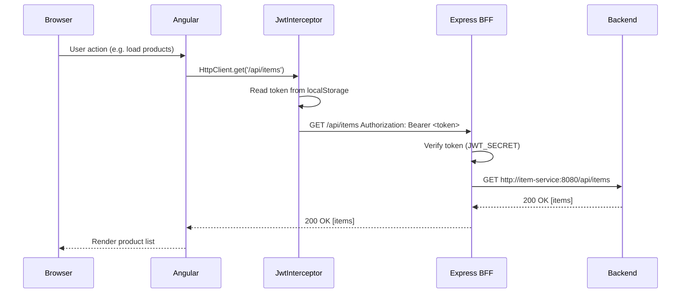
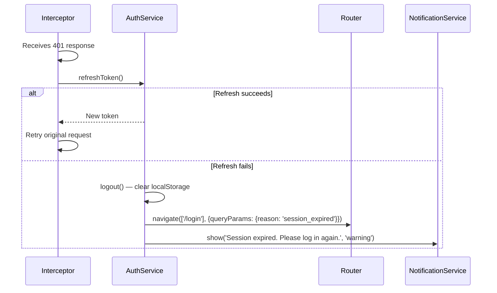

# Design Document: Unified UI — MyIndianStore Branding

## Overview

This document describes the technical design for consolidating six separate UI modules (ui-auth, ui-storefront, ui-checkout, ui-account, ui-admin, ui-main) into a single Angular 18 SPA with MyIndianStore branding. The result is a unified frontend application (`unified-ui/`) that preserves the existing Express.js BFF (Backend for Frontend) proxy pattern from ui-main, integrates all feature areas as lazy-loaded Angular modules, and applies the MyIndianStore visual identity throughout.

The unified application runs on port 4200 and replaces the `ui-main` service in Docker Compose. All 11 backend microservices remain completely unchanged.

### Key Design Decisions

- **Angular 18 standalone-compatible module architecture** with lazy-loaded feature modules for optimal bundle splitting.
- **Express.js BFF layer preserved** — `server.js` handles JWT issuance, token refresh, and proxying to backend services, keeping secrets server-side.
- **CSS custom properties** drive the entire theme so a single `_variables.scss` file controls all brand colors.
- **Two JWT secrets** are maintained: one for customer tokens (issued by the BFF) and one for admin tokens (forwarded to admin-service). This mirrors the existing ui-main behavior.
- **Role-based route guards** enforce access at the Angular router level; the BFF enforces it again at the API proxy level.

---

## Architecture

The system follows a three-tier frontend architecture:

```
Browser (Angular 18 SPA)
        │
        │  HTTP / WebSocket
        ▼
Express.js BFF  (unified-ui/server.js — port 4200)
        │
        │  Internal Docker network
        ├──► user-service:8080        (auth, users)
        ├──► item-service:8080        (product catalog)
        ├──► cart-service:8080        (shopping cart)
        ├──► checkout-service:8080    (checkout flow)
        ├──► order-service:8080       (order management)
        ├──► payment-service:8080     (payments)
        ├──► inventory-service:8080   (stock)
        ├──► return-service:8080      (returns)
        ├──► logistics-service:8088   (shipping)
        ├──► notification-service:8080 (notifications)
        └──► admin-service:8011       (admin operations)
```

### Module Dependency Graph

```mermaid
graph TD
    AppModule --> CoreModule
    AppModule --> SharedModule
    AppModule -->|lazy| AuthModule
    AppModule -->|lazy| StorefrontModule
    AppModule -->|lazy| CheckoutModule
    AppModule -->|lazy| AccountModule
    AppModule -->|lazy| AdminModule

    CoreModule --> AuthService
    CoreModule --> JwtInterceptor
    CoreModule --> GlobalErrorHandler
    CoreModule --> NotificationService

    SharedModule --> AppHeaderComponent
    SharedModule --> AppFooterComponent
    SharedModule --> NavbarComponent
    SharedModule --> LoadingSpinnerComponent
    SharedModule --> NotificationToastComponent

    AuthModule --> LoginComponent
    AuthModule --> RegisterComponent
    AuthModule --> AuthGuard

    StorefrontModule --> HomeComponent
    StorefrontModule --> ProductListComponent
    StorefrontModule --> ProductDetailComponent
    StorefrontModule --> CartComponent

    CheckoutModule --> CheckoutStepperComponent
    CheckoutModule --> OrderConfirmationComponent

    AccountModule --> ProfileComponent
    AccountModule --> OrderHistoryComponent
    AccountModule --> ReturnRequestComponent

    AdminModule --> AdminDashboardComponent
    AdminModule --> AdminGuard
```



### Request Flow: Authenticated API Call



---

## Components and Interfaces

### Directory Structure

```
unified-ui/
├── server.js                          # Express.js BFF
├── package.json
├── angular.json
├── tsconfig.json
├── nginx.conf                         # Production nginx config
├── Dockerfile
├── src/
│   ├── index.html
│   ├── main.ts
│   ├── styles.scss                    # Global styles + theme import
│   ├── environments/
│   │   ├── environment.ts             # Dev: apiUrl = ''  (relative, proxied by BFF)
│   │   └── environment.prod.ts        # Prod: apiUrl = ''
│   └── app/
│       ├── app.module.ts
│       ├── app-routing.module.ts
│       ├── app.component.ts/html/scss
│       ├── core/
│       │   ├── core.module.ts
│       │   ├── services/
│       │   │   ├── auth.service.ts
│       │   │   ├── notification.service.ts
│       │   │   └── global-error-handler.service.ts
│       │   ├── interceptors/
│       │   │   └── jwt.interceptor.ts
│       │   └── guards/
│       │       ├── auth.guard.ts
│       │       └── role.guard.ts
│       ├── shared/
│       │   ├── shared.module.ts
│       │   ├── components/
│       │   │   ├── app-header/
│       │   │   ├── app-footer/
│       │   │   ├── navbar/
│       │   │   ├── loading-spinner/
│       │   │   └── notification-toast/
│       │   └── styles/
│       │       └── _variables.scss    # CSS custom properties + SCSS vars
│       ├── features/
│       │   ├── auth/
│       │   │   ├── auth.module.ts
│       │   │   ├── auth-routing.module.ts
│       │   │   ├── login/
│       │   │   └── register/
│       │   ├── storefront/
│       │   │   ├── storefront.module.ts
│       │   │   ├── storefront-routing.module.ts
│       │   │   ├── home/
│       │   │   ├── product-list/
│       │   │   ├── product-detail/
│       │   │   └── cart/
│       │   ├── checkout/
│       │   │   ├── checkout.module.ts
│       │   │   ├── checkout-routing.module.ts
│       │   │   ├── checkout-stepper/
│       │   │   └── order-confirmation/
│       │   ├── account/
│       │   │   ├── account.module.ts
│       │   │   ├── account-routing.module.ts
│       │   │   ├── profile/
│       │   │   ├── order-history/
│       │   │   └── return-request/
│       │   └── admin/
│       │       ├── admin.module.ts
│       │       ├── admin-routing.module.ts
│       │       └── dashboard/
│       └── assets/
│           ├── images/
│           │   ├── logo.svg
│           │   ├── logo.png
│           │   └── favicon.ico
│           └── fonts/
```

### Shared Components

#### AppHeaderComponent
Displays the MyIndianStore logo, application title, and top-level navigation. Subscribes to `AuthService.currentUser$` to show/hide authenticated links and the logout button.

**Inputs:** none  
**Outputs:** none  
**Template bindings:** `currentUser$`, `onLogout()`

#### NavbarComponent
Role-aware navigation menu. Renders different link sets based on the authenticated user's role. Collapses to a hamburger menu below 768px.

**Inputs:** `@Input() role: UserRole | null`  
**Outputs:** none

#### LoadingSpinnerComponent
Full-screen overlay spinner. Shown/hidden via `LoadingService.isLoading$` (an RxJS `BehaviorSubject<boolean>`).

#### NotificationToastComponent
Stacked toast notifications. Subscribes to `NotificationService.notifications$` and auto-dismisses after 4 seconds. Supports `success`, `error`, `warning`, `info` severity levels.

#### AppFooterComponent
Static footer with brand name, copyright year, and links.

### Core Services

#### AuthService
Central authentication state manager.

```typescript
interface AuthState {
  token: string | null;
  refreshToken: string | null;
  user: AuthUser | null;
  isAuthenticated: boolean;
}

class AuthService {
  private state$ = new BehaviorSubject<AuthState>(initialState);
  currentUser$: Observable<AuthUser | null>;
  isAuthenticated$: Observable<boolean>;

  login(credentials: LoginRequest): Observable<AuthResponse>;
  register(data: RegisterRequest): Observable<AuthResponse>;
  logout(): void;                          // clears localStorage + resets state$
  refreshToken(): Observable<AuthResponse>;
  restoreSession(): void;                  // called in APP_INITIALIZER
  getToken(): string | null;
  getUserRole(): UserRole | null;
}
```

#### JwtInterceptor
HTTP interceptor that reads the token from `AuthService.getToken()` and attaches it as `Authorization: Bearer <token>` to every outgoing request whose URL starts with `/api/`.

```typescript
@Injectable()
class JwtInterceptor implements HttpInterceptor {
  intercept(req: HttpRequest<unknown>, next: HttpHandler): Observable<HttpEvent<unknown>>;
}
```

#### GlobalErrorHandler
Implements Angular's `ErrorHandler` interface. Catches all unhandled errors, logs them to the console, and pushes an error notification via `NotificationService`.

```typescript
@Injectable()
class GlobalErrorHandler implements ErrorHandler {
  handleError(error: unknown): void;
}
```

#### NotificationService
```typescript
interface Notification {
  id: string;
  message: string;
  severity: 'success' | 'error' | 'warning' | 'info';
  timestamp: number;
}

class NotificationService {
  notifications$: Observable<Notification[]>;
  show(message: string, severity: Notification['severity']): void;
  dismiss(id: string): void;
}
```

### Route Guards

#### AuthGuard
Implements `CanActivate`. Returns `true` if `AuthService.isAuthenticated$` is `true`; otherwise navigates to `/login` and returns `false`.

#### RoleGuard
Implements `CanActivate`. Accepts a `data.roles: UserRole[]` route config. Returns `true` if the current user's role is in the allowed list; otherwise navigates to the role-appropriate default route.

### Express.js BFF (server.js)

The BFF is a thin Express.js server that:

1. **Serves the Angular build** from `dist/unified-ui/browser` in production.
2. **Issues JWT tokens** for customer login/register by proxying to user-service and re-signing with `JWT_SECRET`.
3. **Proxies all `/api/*` requests** to the appropriate backend service using `http-proxy-middleware`.
4. **Handles token refresh** by calling user-service's `/api/auth/refresh` endpoint.
5. **Forwards admin requests** with the original token (admin-service validates with its own `ADMIN_JWT_SECRET`).

Proxy routing table in `server.js`:

| Path prefix | Target service | Port |
|---|---|---|
| `/api/auth/*` | user-service | 8080 |
| `/api/users/*` | user-service | 8080 |
| `/api/items/*` | item-service | 8080 |
| `/api/cart/*` | cart-service | 8080 |
| `/api/checkout/*` | checkout-service | 8080 |
| `/api/orders/*` | order-service | 8080 |
| `/api/payments/*` | payment-service | 8080 |
| `/api/inventory/*` | inventory-service | 8080 |
| `/api/returns/*` | return-service | 8080 |
| `/api/logistics/*` | logistics-service | 8088 |
| `/api/notifications/*` | notification-service | 8080 |
| `/api/admin/*` | admin-service | 8011 |

---

## Data Models

### AuthUser
```typescript
interface AuthUser {
  id: string;
  email: string;
  username: string;
  role: UserRole;
}

type UserRole = 'ADMIN' | 'CUSTOMER' | 'GUEST';
```

### AuthState (localStorage schema)
```typescript
// Keys stored in localStorage:
// 'mis_token'         — JWT access token (string)
// 'mis_refresh_token' — JWT refresh token (string)
// 'mis_user'          — JSON-serialized AuthUser
```

### LoginRequest / AuthResponse
```typescript
interface LoginRequest {
  email: string;
  password: string;
}

interface RegisterRequest {
  email: string;
  username: string;
  password: string;
}

interface AuthResponse {
  token: string;
  refreshToken: string;
  user: AuthUser;
}
```

### Notification
```typescript
interface Notification {
  id: string;           // UUID
  message: string;
  severity: 'success' | 'error' | 'warning' | 'info';
  timestamp: number;    // Date.now()
}
```

### Route Configuration
```typescript
// app-routing.module.ts
const routes: Routes = [
  { path: '',          redirectTo: '/home', pathMatch: 'full' },
  { path: 'login',     loadChildren: () => import('./features/auth/auth.module') },
  { path: 'register',  loadChildren: () => import('./features/auth/auth.module') },
  { path: 'home',      loadChildren: () => import('./features/storefront/storefront.module') },
  { path: 'products',  loadChildren: () => import('./features/storefront/storefront.module') },
  { path: 'cart',      loadChildren: () => import('./features/storefront/storefront.module'),
                       canActivate: [AuthGuard] },
  { path: 'checkout',  loadChildren: () => import('./features/checkout/checkout.module'),
                       canActivate: [AuthGuard] },
  { path: 'account',   loadChildren: () => import('./features/account/account.module'),
                       canActivate: [AuthGuard, RoleGuard],
                       data: { roles: ['CUSTOMER', 'ADMIN'] } },
  { path: 'admin',     loadChildren: () => import('./features/admin/admin.module'),
                       canActivate: [AuthGuard, RoleGuard],
                       data: { roles: ['ADMIN'] } },
  { path: '**',        redirectTo: '/home' },
];
```

### Theme Configuration (_variables.scss)
```scss
// MyIndianStore Brand Colors
:root {
  --mis-primary:        #FF6B35;   // Saffron/orange — CTAs, buttons, links
  --mis-primary-dark:   #E55A24;   // Hover state for primary
  --mis-secondary:      #2D6A4F;   // Deep green — headers, accents
  --mis-secondary-dark: #1E4D38;   // Hover state for secondary
  --mis-background:     #FFF8F0;   // Cream — page background
  --mis-surface:        #FFFFFF;   // Card/panel background
  --mis-text-primary:   #1A1A1A;   // Main body text
  --mis-text-secondary: #6B6B6B;   // Muted/secondary text
  --mis-border:         #E8D5C4;   // Warm border color
  --mis-error:          #D32F2F;   // Error states
  --mis-success:        #388E3C;   // Success states
  --mis-warning:        #F57C00;   // Warning states

  // Typography
  --mis-font-family:    'Poppins', 'Noto Sans', sans-serif;
  --mis-font-size-base: 16px;

  // Spacing
  --mis-radius:         8px;
  --mis-radius-lg:      16px;
  --mis-shadow:         0 2px 8px rgba(0,0,0,0.08);
}
```

### Docker Compose Service Definition (unified-ui)
```yaml
unified-ui:
  image: myindianstore-unified-ui:1.0.0
  build:
    context: ./unified-ui
    dockerfile: Dockerfile
  ports:
    - "4200:4200"
  depends_on:
    - user-service
    - item-service
    - cart-service
    - checkout-service
    - order-service
    - payment-service
    - inventory-service
    - return-service
    - admin-service
    - logistics-service
    - notification-service
  environment:
    PORT: 4200
    JWT_SECRET: your-unified-secret-key
    ADMIN_JWT_SECRET: adminSecretKeyForJWTTokenGenerationAndValidation2025WithExtraLengthToMeetHS512Requirements
    USER_SERVICE_URL: http://user-service:8080
    ITEM_SERVICE_URL: http://item-service:8080
    CART_SERVICE_URL: http://cart-service:8080
    CHECKOUT_SERVICE_URL: http://checkout-service:8080
    ORDER_SERVICE_URL: http://order-service:8080
    PAYMENT_SERVICE_URL: http://payment-service:8080
    INVENTORY_SERVICE_URL: http://inventory-service:8080
    RETURN_SERVICE_URL: http://return-service:8080
    LOGISTICS_SERVICE_URL: http://logistics-service:8088
    NOTIFICATION_SERVICE_URL: http://notification-service:8080
    ADMIN_SERVICE_URL: http://admin-service:8011
```

---

## Correctness Properties

*A property is a characteristic or behavior that should hold true across all valid executions of a system — essentially, a formal statement about what the system should do. Properties serve as the bridge between human-readable specifications and machine-verifiable correctness guarantees.*

The following properties were derived from the prework analysis of acceptance criteria. Properties were identified for requirements 7.2–7.5, 8.1, 8.2, 8.4, and 13.1, as these involve logic that varies meaningfully with input and is cost-effective to test with many iterations. UI rendering, configuration, and infrastructure requirements are covered by example-based and smoke tests instead.

**Property Reflection:** After reviewing all candidate properties:
- Requirements 7.2 and 7.7 are identical (unauthenticated redirect to /login) — merged into Property 1.
- Requirements 7.3, 7.4, and 7.5 all describe the same role-redirect invariant with different role values — merged into Property 2.
- Requirement 8.7 (validate JWT before protected routes) is subsumed by Property 1 (the guard enforces this).
- All remaining properties are logically independent and provide unique validation value.

### Property 1: Unauthenticated Access Always Redirects to Login

*For any* protected route path in the application, when a user without a valid authentication token attempts to navigate to that route, the Angular router SHALL redirect the user to `/login` and the protected route SHALL NOT be activated.

**Validates: Requirements 7.2, 7.7, 8.7**

### Property 2: Role-Based Post-Login Redirect

*For any* user with a defined role (ADMIN, CUSTOMER, or GUEST), after a successful login the Angular router SHALL redirect to the role-appropriate route — `/admin` for ADMIN, `/account` for CUSTOMER, and `/home` for GUEST — and SHALL NOT redirect to any other route.

**Validates: Requirements 7.3, 7.4, 7.5**

### Property 3: Authentication State Consistency

*For any* authentication state where a JWT token is present in `localStorage` under the key `mis_token`, the `AuthService.isAuthenticated$` observable SHALL emit `true` and `AuthService.currentUser$` SHALL emit a non-null `AuthUser` object.

**Validates: Requirements 8.1, 8.3**

### Property 4: JWT Token Injection on All API Calls

*For any* HTTP request made through Angular's `HttpClient` to a URL path starting with `/api/`, when a valid token exists in `localStorage`, the outgoing request SHALL contain an `Authorization` header with value `Bearer <token>`. Requests made without a token SHALL NOT have an `Authorization` header added.

**Validates: Requirements 8.2**

### Property 5: Logout Clears All Authentication State

*For any* authenticated session state (regardless of token value, user role, or how many items are stored), calling `AuthService.logout()` SHALL result in `localStorage` containing no keys prefixed with `mis_` and `AuthService.isAuthenticated$` emitting `false`.

**Validates: Requirements 8.4**

### Property 6: HTTP Errors Always Surface as Notifications

*For any* HTTP error response (status codes 4xx or 5xx) returned from a backend API call, the `NotificationService` SHALL emit at least one notification with severity `error` containing a non-empty message string. No HTTP error SHALL be silently swallowed.

**Validates: Requirements 13.1**

---

## Error Handling

### HTTP Error Handling Strategy

The `JwtInterceptor` also handles error responses:

- **401 Unauthorized**: Attempt token refresh once. If refresh fails, call `AuthService.logout()` and navigate to `/login` with a query param `?reason=session_expired`.
- **403 Forbidden**: Show error notification "You don't have permission to perform this action."
- **404 Not Found**: Show error notification "The requested resource was not found."
- **5xx Server Errors**: Show error notification "Something went wrong. Please try again later."
- **Network errors (0 status)**: Show error notification "Unable to connect. Please check your internet connection."

All HTTP errors are also passed to `GlobalErrorHandler` for console logging.

### Global Error Handler

`GlobalErrorHandler` implements Angular's `ErrorHandler`:

```typescript
handleError(error: unknown): void {
  const message = error instanceof Error ? error.message : String(error);
  console.error('[MyIndianStore] Unhandled error:', error);
  this.notificationService.show(
    'An unexpected error occurred. Please refresh the page.',
    'error'
  );
}
```

### Form Validation Errors

All reactive forms use Angular's built-in validators. Error messages are displayed inline beneath each field using a shared `FormErrorComponent` that reads the control's error state. Errors appear on `blur` or on form submission attempt.

### Authentication Error Flow



---

## Testing Strategy

### Overview

The testing strategy uses a dual approach: example-based unit/integration tests for specific behaviors and property-based tests for universal invariants. Property-based tests use **fast-check** (the standard PBT library for TypeScript/JavaScript).

### Property-Based Tests (fast-check)

Each property test runs a minimum of **100 iterations**. Tests are tagged with a comment referencing the design property.

**Property 1 — Unauthenticated redirect:**
```typescript
// Feature: unified-ui-myindianstore-branding, Property 1:
// Unauthenticated access to any protected route always redirects to /login
it('should redirect unauthenticated users from any protected route to /login', () => {
  fc.assert(fc.property(
    fc.constantFrom('/cart', '/checkout', '/account', '/admin', '/account/orders'),
    (route) => {
      // Set up unauthenticated state (no token in localStorage)
      // Attempt navigation to route
      // Assert: current URL is /login, protected component not activated
    }
  ), { numRuns: 100 });
});
```

**Property 2 — Role-based redirect:**
```typescript
// Feature: unified-ui-myindianstore-branding, Property 2:
// Login always redirects to the role-appropriate route
it('should redirect to role-appropriate route after login', () => {
  fc.assert(fc.property(
    fc.record({
      role: fc.constantFrom('ADMIN', 'CUSTOMER', 'GUEST'),
      token: fc.string({ minLength: 10 }),
    }),
    ({ role, token }) => {
      const expectedRoute = { ADMIN: '/admin', CUSTOMER: '/account', GUEST: '/home' }[role];
      // Simulate login response with given role
      // Assert: router navigated to expectedRoute
    }
  ), { numRuns: 100 });
});
```

**Property 3 — Auth state consistency:**
```typescript
// Feature: unified-ui-myindianstore-branding, Property 3:
// Token in localStorage implies isAuthenticated = true
it('should be authenticated whenever a token is in localStorage', () => {
  fc.assert(fc.property(
    fc.record({
      token: fc.string({ minLength: 10 }),
      user: fc.record({ id: fc.uuid(), email: fc.emailAddress(), role: fc.constantFrom('ADMIN', 'CUSTOMER', 'GUEST') }),
    }),
    ({ token, user }) => {
      localStorage.setItem('mis_token', token);
      localStorage.setItem('mis_user', JSON.stringify(user));
      authService.restoreSession();
      // Assert: isAuthenticated$ emits true, currentUser$ emits non-null
    }
  ), { numRuns: 100 });
});
```

**Property 4 — JWT injection:**
```typescript
// Feature: unified-ui-myindianstore-branding, Property 4:
// All /api/* requests include Authorization header when token exists
it('should inject Authorization header on all /api/ requests when authenticated', () => {
  fc.assert(fc.property(
    fc.record({
      token: fc.string({ minLength: 10 }),
      path: fc.stringMatching(/^\/api\/[a-z]+\/[a-z0-9-]+$/),
      method: fc.constantFrom('GET', 'POST', 'PUT', 'DELETE'),
    }),
    ({ token, path, method }) => {
      localStorage.setItem('mis_token', token);
      // Make HTTP request through interceptor
      // Assert: outgoing request has Authorization: Bearer <token>
    }
  ), { numRuns: 100 });
});
```

**Property 5 — Logout completeness:**
```typescript
// Feature: unified-ui-myindianstore-branding, Property 5:
// Logout always clears all mis_ keys from localStorage
it('should clear all auth state from localStorage on logout', () => {
  fc.assert(fc.property(
    fc.record({
      token: fc.string({ minLength: 10 }),
      refreshToken: fc.string({ minLength: 10 }),
      user: fc.record({ id: fc.uuid(), email: fc.emailAddress(), role: fc.constantFrom('ADMIN', 'CUSTOMER', 'GUEST') }),
    }),
    ({ token, refreshToken, user }) => {
      localStorage.setItem('mis_token', token);
      localStorage.setItem('mis_refresh_token', refreshToken);
      localStorage.setItem('mis_user', JSON.stringify(user));
      authService.logout();
      const remainingKeys = Object.keys(localStorage).filter(k => k.startsWith('mis_'));
      // Assert: remainingKeys.length === 0
      // Assert: isAuthenticated$ emits false
    }
  ), { numRuns: 100 });
});
```

**Property 6 — Error propagation:**
```typescript
// Feature: unified-ui-myindianstore-branding, Property 6:
// All HTTP errors surface as error notifications
it('should show an error notification for any HTTP error response', () => {
  fc.assert(fc.property(
    fc.record({
      status: fc.integer({ min: 400, max: 599 }),
      url: fc.stringMatching(/^\/api\/[a-z]+/),
    }),
    ({ status, url }) => {
      // Simulate HTTP error response with given status
      // Assert: notificationService has at least one notification with severity 'error'
      // Assert: notification message is non-empty string
    }
  ), { numRuns: 100 });
});
```

### Unit Tests (Jasmine/Karma)

- **AuthService**: Login/logout/refresh flows, localStorage read/write, session restore on init.
- **JwtInterceptor**: Token injection, 401 handling, retry logic, passthrough for non-`/api/` URLs.
- **AuthGuard / RoleGuard**: Redirect behavior for each role and unauthenticated state.
- **NotificationService**: Add/dismiss notifications, auto-dismiss timing.
- **GlobalErrorHandler**: Error capture and notification dispatch.
- All feature module components: Input/output bindings, template rendering with mock services.

Coverage targets: 80% for services, 70% for components.

### Integration Tests

- Login → redirect to role route → access protected page.
- Add to cart → checkout flow → order confirmation.
- Admin login → admin dashboard access.
- Token expiry → refresh → retry → success.
- Token expiry → refresh fails → redirect to /login.

### End-to-End Tests (Playwright)

Critical user journeys:
1. Guest browses products → registers → logs in → adds to cart → checks out.
2. Customer logs in → views order history → submits return request.
3. Admin logs in → views dashboard → manages inventory.

### Linting and Code Quality

- ESLint with `@angular-eslint` ruleset.
- Prettier for formatting.
- Husky pre-commit hook runs lint + unit tests.
- CI pipeline (GitHub Actions) runs full test suite on every push.

### Build Verification

- Production build must complete in under 5 minutes.
- Bundle size budget: main bundle < 500KB gzipped, each lazy module < 200KB gzipped.
- Lighthouse CI enforces FCP < 2s and TTI < 5s on simulated 3G.
