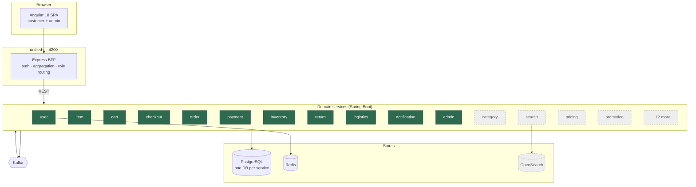
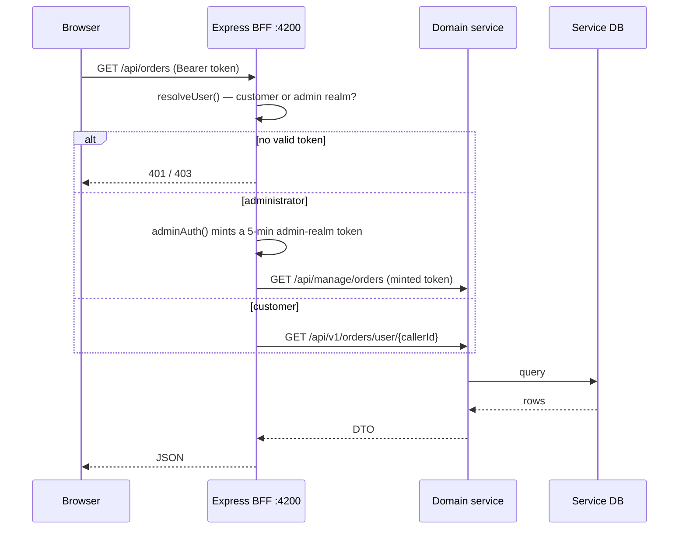

# Architecture

Current state and target state. Everything marked **today** was verified against the
running stack; everything marked **target** is not built yet.

## 1. System context

Green = exists today. Dashed grey = specified, not built.

## 2. Request path

The browser only ever talks to the BFF. Service ports are published in
`docker-compose.yml` for local debugging and **must not be exposed in production**.

The customer branch scopes by the id **in the token**, never one from the URL. Routes
that take an id in the path (`/api/orders/:id`, `/api/payments/:id`) compare the
resource owner against the caller and return 404 on mismatch.

## 3. Why a BFF

The Angular app would otherwise need to know eleven base URLs, two token formats and
which service owns which resource. The BFF gives one origin (no CORS in production),
one session model, and a place to enforce authorization before a request reaches a
service. It also absorbs the two identity realms
([ADR-0004](adr/0004-two-identity-realms.md)).

It is a **routing and authorization layer, not a business layer**. Pricing, totals,
inventory and order state belong in the services.

## 4. Synchronous vs asynchronous

| Use REST when | Use Kafka when |
|---|---|
| The caller needs the answer to continue | Other domains react to something that happened |
| Reading for display | Fan-out to several consumers |
| A saga step whose result drives the next step | Search indexing, notifications, analytics |

Consistency expectations:

| Strongly consistent | Eventually consistent |
|---|---|
| Payment state, inventory reservation, order creation | Search index, recommendations, analytics, notifications |

If a user action must be reflected immediately on screen, it cannot depend on a Kafka
round-trip.

## 5. Current gaps against the target

| Area | Today | Target |
|---|---|---|
| Catalogue | Flat `Item` — sku, name, description, price, quantity, itemType | Product → variants → SKUs, brand, category, attributes, media |
| Categories | A hardcoded list in the Angular header | `category-service` with a real taxonomy |
| Search | BFF filters the full `/items` list in memory | `search-service` on OpenSearch, indexed from Kafka |
| Pricing | A single `price` column on the item | `pricing-service`: MRP, selling price, effective dates, history |
| Promotions | None | `promotion-service` |
| Order model | `customerId`, items, total. **No address, tax, or shipping** | Full snapshots — see [order-flow](flows/order-flow.md) |
| Checkout | Sequential BFF calls | Saga with compensation |
| Schema | Hibernate `ddl-auto: update` | Flyway migrations ([ADR-0003](adr/0003-schema-migrations.md)) |
| Sellers | None | `seller-service`, `seller_id` on offers and order items |
| Observability | Actuator health only | Correlation ids, tracing, metrics |

## 6. Constraints that shaped the current design

- **Prebuilt jars.** Service Dockerfiles are `COPY target/*.jar` with no Maven stage,
  so `mvn package` must run before `docker compose build`. Fast local rebuilds, but a
  stale jar silently ships old code — `logistics-service`'s jar is stale today.
- **`ddl-auto: update`** means schema drift is invisible and destructive changes are
  impossible. Blocking for production; see [ADR-0003](adr/0003-schema-migrations.md).
- **Two identity realms** predate this documentation. See
  [ADR-0004](adr/0004-two-identity-realms.md).

## 7. Deployment target

See [`deployment.md`](deployment.md). Local is Docker Compose; production is
AWS (ALB → ECS/EKS → RDS/ElastiCache/MSK/OpenSearch), with CloudFront in front of the
SPA's static assets.
