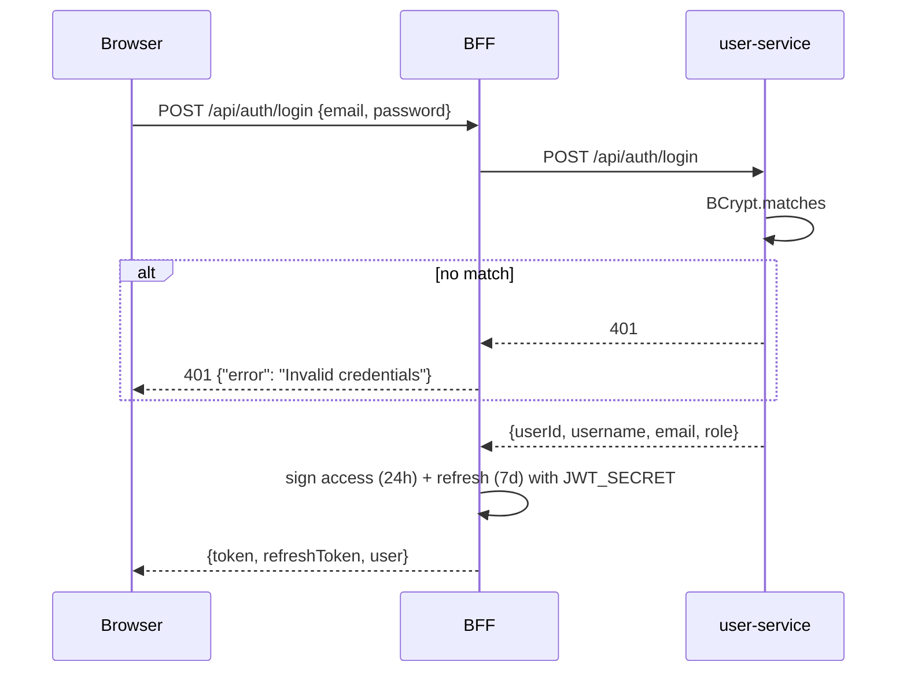
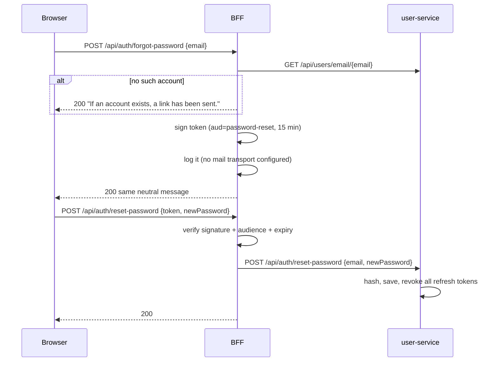

# Authentication

Two realms exist. Read [ADR-0004](adr/0004-two-identity-realms.md) before changing
anything here.

| | Customer realm | Admin realm |
|---|---|---|
| Store | `user_service.users` | `admin_db.admin_users` |
| Signed by | the BFF | admin-service |
| Secret | `JWT_SECRET` | `ADMIN_JWT_SECRET` |
| Algorithm | HS256 | HS512 (needs ≥64-byte key) |
| Claims | `{id, username, email, role}` | `{sub, role}` |
| Lifetime | 24 h | 24 h |

## Login

A username may be given instead of an email; the BFF resolves it via
`GET /api/users/username/:username` first.

The response is identical for an unknown email and a wrong password — no account
enumeration.

## Token storage

Tokens live in `localStorage` under `mis_token`, `mis_refresh_token`, `mis_user`, and
are restored on boot by an `APP_INITIALIZER`.

`localStorage` is readable by any script on the origin, so this trades XSS resistance
for simplicity. `httpOnly` cookies plus CSRF protection is the stronger design and is
the eventual target; it is a larger change because the BFF would own session state.
Until then, **XSS is an account-takeover vector** — never render unsanitised HTML.

## Refresh

The Angular interceptor refreshes on a 401 and retries the original request once,
queueing concurrent requests behind a single refresh.

Two rules that were learned the hard way:

1. **Do not refresh on auth endpoints.** A wrong password returns 401 from
   `/api/auth/login`; refreshing there logged the user out and told them their session
   had expired. The interceptor now skips `/api/auth/*`.
2. **Do not refresh without a refresh token.** Otherwise every 401 becomes a forced
   logout.

`POST /api/auth/refresh` did not exist at all until recently — the interceptor called
it on every 401 and the failure path always ran.

## Password reset

**Two steps.** The previous single-call version accepted `{email, newPassword}`
unauthenticated and reset any account given only its address.

The response is deliberately identical whether or not the account exists.

**Not production-ready:** there is no mail transport, so the token is logged and — only
when `ALLOW_DEV_PASSWORD_RESET=true` — returned in the response. Wire this to
`notification-service` before launch and remove the flag. Tokens should also be
single-use (stored and invalidated on redemption); today a token can be replayed
within its 15-minute window.

## Password storage

BCrypt, cost 10, via Spring Security's `PasswordEncoder`. Never logged, never returned
in a DTO, never in an event.

Changing a password revokes every refresh token, ending other sessions. That revoke
is a `@Modifying` bulk update — see the warning in
[`../CLAUDE.md`](../CLAUDE.md#conventions); getting it wrong silently discarded every
password change in this codebase.

## Not implemented

- MFA (the token model has room for an `amr` claim)
- Email and mobile verification
- Account lockout after repeated failures
- Refresh-token rotation with reuse detection
- OAuth2 / social login
- Server-side session revocation for access tokens (a stolen access token is valid
  for its full 24 h; Redis holds a blacklist that is not yet enforced BFF-side)
