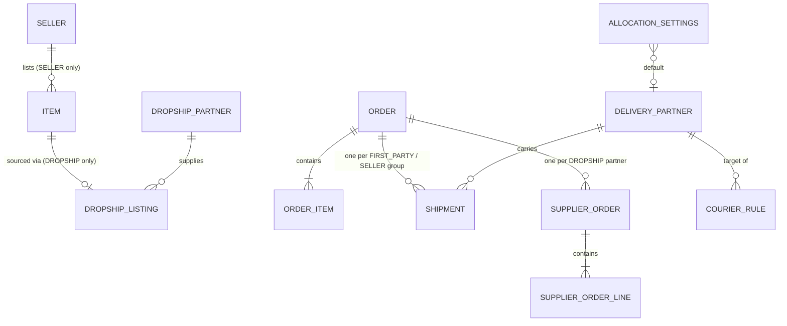
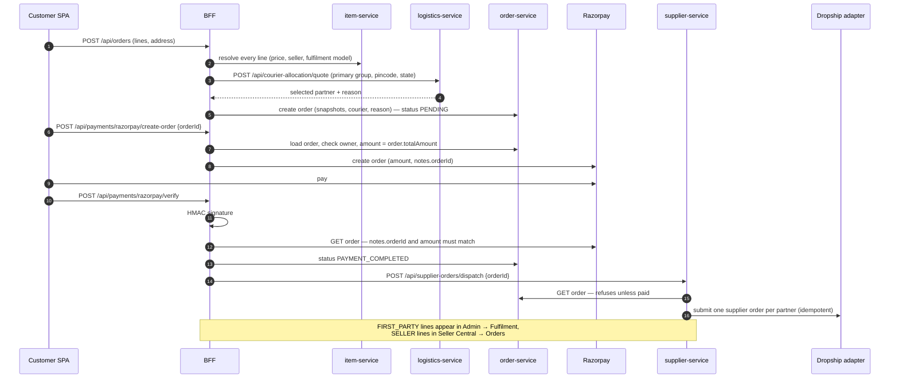
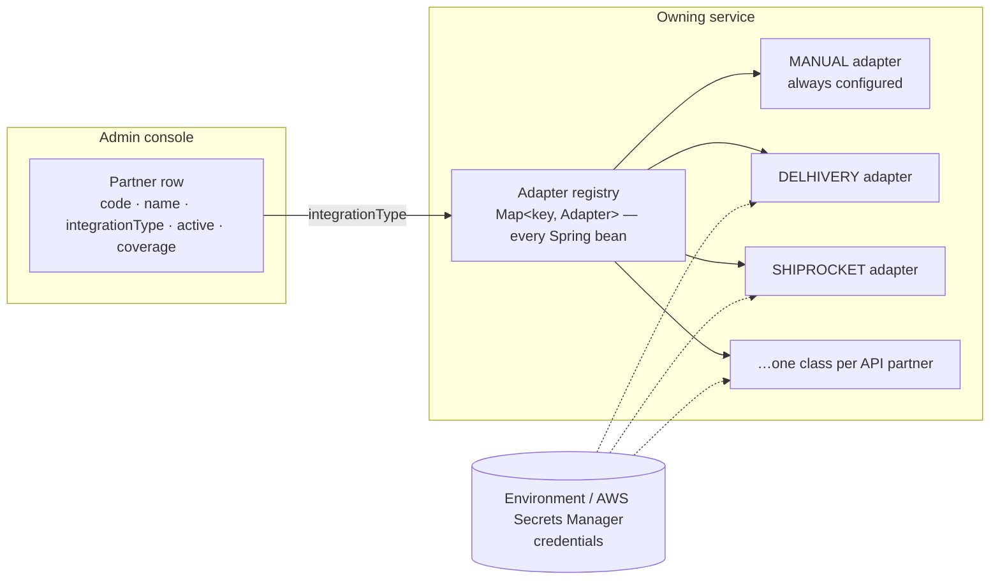
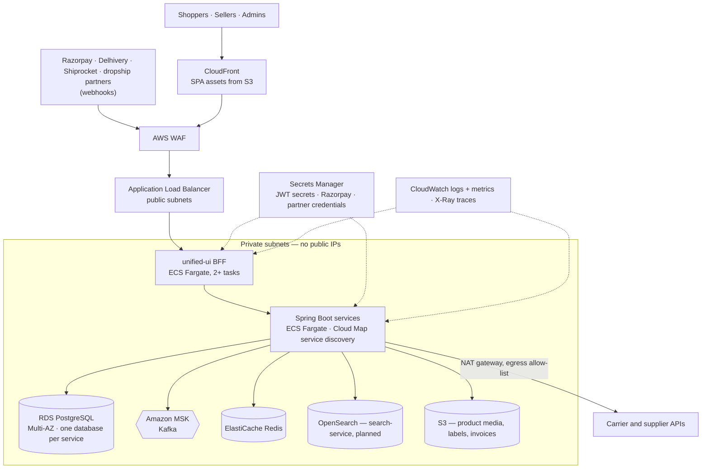

# Commerce Architecture — Own Retail, Marketplace Sellers and Dropshipping on One Platform

**Status:** Phase M1 (built in this change) plus the target for later phases.
Every section says which it is. Where this document and the code disagree, the code
wins ([`README.md`](README.md) rule 1).

Read with [`architecture.md`](architecture.md) (system context, BFF, sync vs async) and
[`service-catalog.md`](service-catalog.md) (what exists).

---

## 1. The one-sentence design

> **There is one catalogue, one cart, one checkout, one order and one payment. How a
> line gets to the customer is a property of the offer — its *fulfilment model* — and
> every courier or supplier we work with sits behind an adapter.**

We do not build a "marketplace system" next to a "dropship system" next to the store.
They differ in exactly three places:

1. **Who owns the stock and ships it** — recorded on the offer as `fulfilmentModel`.
2. **What happens after payment** — the order is split into *fulfilment groups*, and
   each group is routed to whoever ships it.
3. **Who gets paid** — settlement (planned, §11.3).

Everything a shopper touches — search, product page, cart, checkout, Razorpay, order
history, returns — is shared and unaware of the model except for an honest
"Sold by / Ships from" label.

### Principles

| # | Principle | Consequence |
|---|---|---|
| P1 | One order aggregate | A mixed basket (own + seller + dropship) is one order, one payment, several shipments |
| P2 | Fulfilment model on the offer, snapshotted on the order line | Changing how a product is sourced never rewrites order history (rule 5) |
| P3 | Partners are data **plus** an adapter | A partner with no API is a database row. A partner with an API is one class and some env vars |
| P4 | Nothing is placed with a supplier before payment is confirmed server-side | Dropship dispatch checks the order's paid status itself; it does not trust its caller |
| P5 | Courier choice is explainable | Every assignment records *why* (`MANUAL` / `RULE` / `DEFAULT` / `STRATEGY`) |
| P6 | No fake integrations | An adapter without credentials says "not configured" and the system falls back to manual handling, labelled as manual. A configured adapter that fails returns an error — it never invents a tracking number |

---

## 2. Starting point (verified 2026-09-14)

| Area | Today, before this change |
|---|---|
| Catalogue | `item-service` `Item` with `sellerId` (null = own stock). No fulfilment model |
| Orders | `order-service` snapshots price, name, address, customer, `sellerId` per line, one courier per order |
| Sellers | `seller-service` with approval workflow; Seller Central (5 views) in the SPA |
| Couriers | 6 rows in `logistics-service`; checkout picks the fastest serviceable one; no default, no location rules, no override, no carrier API |
| Shipments | `findByOrderId` returns **one** — a two-seller order cannot hold two shipments |
| Dropship | Nothing |
| Payment | Razorpay in the BFF. **The amount comes from the browser**, and verification does not bind the Razorpay order to our order (fixed in M1, §11.1) |

---

## 3. Three business models, one platform

| | `FIRST_PARTY` — own product | `SELLER` — marketplace | `DROPSHIP` — partner supplied |
|---|---|---|---|
| Listed by | Admin | Approved seller | Admin, linked to a supplier SKU |
| Owns stock | MyIndianStore | Seller | Dropship partner |
| Sets selling price | MyIndianStore | Seller | MyIndianStore (cost price is private) |
| `Item.sellerId` | null | seller id | null |
| `Item.fulfilmentPartnerCode` | null | null | partner code, e.g. `QIKINK` |
| Ships from | Our warehouse pincode | Seller pickup pincode | Partner warehouse |
| Courier chosen by | Allocation engine; admin may override | Allocation engine suggests; seller may override | Partner's own logistics, or allocation engine when the partner does not ship |
| Work queue | Admin → **Fulfilment** | Seller Central → **Orders** | Admin → **Supplier orders** |
| Customer label | "Sold and shipped by MyIndianStore" | "Sold by {seller}" | "Ships from our partner warehouse" |
| Money | Revenue | Commission (planned) | Margin = price − cost |

Legacy rows with `fulfilmentModel = null` resolve to `SELLER` when `sellerId` is set,
otherwise `FIRST_PARTY`, so no data migration is needed.

A future **seller stock in our warehouse** model (Amazon FBA) is `SELLER` + a
`fulfilledByPlatform` flag. It is not needed yet and is deliberately not modelled.

---

## 4. Domain model



No arrow above crosses a database as a foreign key — each is a plain id or code column
([ADR-0001](adr/0001-database-per-service.md)).

| Entity | Service / DB | Phase |
|---|---|---|
| `Item.fulfilmentModel`, `Item.fulfilmentPartnerCode` | item-service | M1 |
| `OrderItem.fulfilmentModel`, `OrderItem.fulfilmentPartnerCode`, `Order.deliveryAssignmentReason` | order-service | M1 |
| `DeliveryPartner` (+ `integrationType`, `aggregator`, `priority`, `codSupported`) | logistics-service | M1 |
| `CourierRule`, `AllocationSettings` | logistics-service | M1 |
| `Shipment.fulfilmentKey`, `partnerCode`, `bookingMode`, `labelUrl`, `trackingGenerated` | logistics-service | M1 |
| `DropshipPartner`, `DropshipListing`, `SupplierOrder`, `SupplierOrderLine` | **supplier-service (new)** | M1 |
| `SellerCommission`, `Settlement`, `Payout` | settlement-service | planned |

### 4.1 Fulfilment groups

A group is the unit that ships together. It is **derived** from the order lines, never
stored separately, so it cannot drift from them:

| Line | `fulfilmentKey` |
|---|---|
| `FIRST_PARTY` | `FIRST_PARTY` |
| `SELLER`, sellerId 3 | `SELLER:3` |
| `DROPSHIP`, partner `QIKINK` | `DROPSHIP:QIKINK` |

A group is **shipped** when a shipment exists with its key (`FIRST_PARTY`, `SELLER:*`)
or its supplier order is `SHIPPED`/`DELIVERED` (`DROPSHIP:*`). A shipment recorded
before M1 has no key and is treated as covering the whole order. The order becomes
`SHIPPED` only when **every** group is shipped — previously the first seller to ship
marked a multi-seller order shipped.

The order-level `deliveryPartnerCode` names the courier of the **primary group**:
`FIRST_PARTY` if present, otherwise the first seller group. Per-group couriers live on
the shipments.

---

## 5. Order lifecycle across the three models



After payment each group moves independently:

| Group | Actor | Action | Result |
|---|---|---|---|
| `FIRST_PARTY` | Admin | Fulfilment → pick courier (pre-selected by allocation) → Ship | `POST /api/shipments/book` with key `FIRST_PARTY` |
| `SELLER:n` | Seller | Orders → Hand to courier (pre-selected) → Mark shipped | booking with key `SELLER:n` |
| `DROPSHIP:X` | Partner, or admin for manual partners | Partner ships; tracking arrives by webhook/poll, or admin records it | supplier order → `SHIPPED` |

After every one of these the BFF recomputes the groups (§4.1) and moves the order to
`SHIPPED` only when all are shipped.

**Order status values.** M1 adds none. `PAYMENT_COMPLETED` already exists. A partially
shipped order stays `PAYMENT_COMPLETED` and shows per-group progress, because Hibernate 6
creates a `CHECK` constraint for enum columns that `ddl-auto: update` can never widen
— adding `PARTIALLY_SHIPPED` would fail on every existing database until Flyway lands
([ADR-0003](adr/0003-schema-migrations.md)). For the same reason, **new** enum-valued
columns in M1 are stored as `varchar` and converted in code.

---

## 6. Courier allocation

The requirement: *for our own products a default courier is used; it changes
automatically by shipping location; and a person can pick one manually.*

`logistics-service` owns the decision in `CourierAllocationService`. Checkout, Admin →
Fulfilment, Seller Central and the admin coverage probe all call the same endpoint, so
the courier shown in a preview is the courier that gets assigned.

### 6.1 Inputs

`fulfilmentModel`, `deliveryPincode`, `deliveryState`, optional `pickupPincode`, `cod`,
optional `preferredPartnerCode` (the manual choice).

### 6.2 Candidates

A partner is a candidate when it is **active**, covers the **delivery pincode**
(`servicePincodePrefixes`, empty = nationwide), and supports COD if the order is COD.

### 6.3 Decision order — first match wins

| Step | Source | Reason recorded |
|---|---|---|
| 1 | `preferredPartnerCode` is a candidate and the model's settings allow manual override | `MANUAL` |
| 2 | First active `CourierRule` for this model (or for any model), ordered by `priority` then `id`, whose pincode prefixes **or** states match the address and whose partner is a candidate | `RULE` |
| 3 | `AllocationSettings.defaultPartnerCode` for this model, if a candidate | `DEFAULT` |
| 4 | `AllocationSettings.fallbackStrategy` over the candidates: `FASTEST` (days, then rate), `CHEAPEST` (rate, then days), `PRIORITY` (priority, then days) | `STRATEGY` |
| 5 | No candidate | `NONE` — the order is still created, with no courier, and the queue shows it as unassignable |

A manual choice that cannot be honoured is **not** silently replaced: the response
carries `manualOverrideRejected` with the reason (for example *"DTDC does not serve
794001"*), and the UIs show it.

Out of the box every model uses `FASTEST` with no default and no rules — exactly the
behaviour before M1. Picking a default courier is a business decision, so the seed
does not make it.

### 6.4 Worked example

Settings: `FIRST_PARTY` default **Delhivery**, strategy `CHEAPEST`.
Rules: *South metros* — prefixes `56,60,50` → **Blue Dart**, priority 10;
*North-east* — states `Assam, Meghalaya, Manipur, Mizoram, Nagaland, Tripura,
Arunachal Pradesh, Sikkim` → **India Post**, priority 20.

| Delivery | Manual pick | Assigned | Reason |
|---|---|---|---|
| 560038 Bengaluru | — | Blue Dart | `RULE` South metros |
| 781001 Guwahati, Assam | — | India Post | `RULE` North-east |
| 110001 Delhi | — | Delhivery | `DEFAULT` |
| 110001 Delhi | XpressBees | XpressBees | `MANUAL` |
| 110001 Delhi, Delhivery disabled | — | cheapest candidate | `STRATEGY` |

### 6.5 Where manual selection happens

| Who | Where | Effect |
|---|---|---|
| Admin | Fulfilment → order → courier select | Books the `FIRST_PARTY` group with that partner |
| Seller | Seller Central → Orders → Hand to courier | Books that seller's group |
| Admin | Delivery partners → Allocation → probe | Preview only; nothing is booked |

---

## 7. Plug-and-play partners

Couriers and dropship suppliers use the same pattern: **a registry row an admin edits,
and an adapter the row points at by key.**



### 7.1 Carrier adapter SPI — `logistics-service`, package `com.example.carrier`

```java
public interface CarrierAdapter {
    String key();                              // matches DeliveryPartner.integrationType
    String label();
    boolean isConfigured();                    // credentials present
    Set<CarrierCapability> capabilities();     // LIVE_SERVICEABILITY, BOOKING, TRACKING, CANCELLATION
    List<String> requiredEnvironment();        // names only, never values
    default Optional<List<LiveQuote>> liveServiceability(
            String pickupPincode, String deliveryPincode, int weightGrams, boolean cod) {
        return Optional.empty();
    }
    BookingResult book(BookingRequest request);            // throws CarrierException
    default Optional<TrackingSnapshot> track(String awb) { return Optional.empty(); }
    default void cancel(String awb) { throw new UnsupportedOperationException(); }
}
```

| Adapter key | Status | Needs |
|---|---|---|
| `MANUAL` | built | nothing — tracking number entered by a person, or generated and flagged `trackingGenerated` |
| `DELHIVERY` | built, **not exercised against a live account** | `DELHIVERY_API_TOKEN`, `DELHIVERY_BASE_URL`, `DELHIVERY_PICKUP_LOCATION` |
| `SHIPROCKET` | built, **not exercised against a live account** | `SHIPROCKET_EMAIL`, `SHIPROCKET_PASSWORD`, `SHIPROCKET_BASE_URL`, `SHIPROCKET_PICKUP_LOCATION` |

Booking a shipment (`POST /api/shipments/book`):

| Partner's adapter | Result |
|---|---|
| `MANUAL`, or an API adapter that is **not configured** | Booked manually: `bookingMode=MANUAL`, supplied tracking number or a generated one flagged `trackingGenerated=true`, with a note naming the missing configuration |
| API adapter, configured, succeeds | `bookingMode=API`, the carrier's AWB and label URL |
| API adapter, configured, fails | **502** with the carrier's message. Nothing is invented |

### 7.2 Dropship adapter SPI — `supplier-service`, package `com.example.dropship`

```java
public interface DropshipAdapter {
    String key();
    String label();
    boolean isConfigured();
    Set<DropshipCapability> capabilities();    // ORDER_SUBMISSION, STATUS_POLLING, WEBHOOKS, STOCK_SYNC
    List<String> requiredEnvironment();
    SubmissionResult submit(SupplierOrder order, DropshipPartner partner);
    default Optional<StatusUpdate> fetchStatus(String partnerOrderRef) { return Optional.empty(); }
    default Optional<List<StockLevel>> fetchStock(List<String> partnerSkus) { return Optional.empty(); }
    default Optional<WebhookEvent> parseWebhook(Map<String, String> headers, byte[] body) {
        return Optional.empty();               // empty = this partner has no webhook integration
    }
}
```

| Adapter key | Status | Needs |
|---|---|---|
| `MANUAL` | built | nothing — `submit` puts the supplier order in `AWAITING_MANUAL_PLACEMENT`; an operator places it on the partner's portal and records the reference and tracking number in Admin → Supplier orders |
| `QIKINK` | built against Qikink's published API, **not exercised against a Qikink account** | `QIKINK_CLIENT_ID`, `QIKINK_CLIENT_SECRET`, `QIKINK_BASE_URL` (sandbox by default), `QIKINK_SEARCH_FROM_MY_PRODUCTS` |

The Qikink adapter (`com.example.dropship.qikink`) does a form-encoded token exchange
at `POST /api/token` (`ClientId`, `client_secret` → `Accesstoken`, `expires_in`), caches
the token, and submits `POST /api/order/create` with `ClientId` / `Accesstoken` headers.
Documented constraints it enforces: `order_number` ≤ 15 characters; `quantity`, `price`
and `total_order_value` are JSON strings; `gateway` is `Prepaid` (checkout is
Razorpay-only); `qikink_shipping = "1"` so Qikink ships. A retry after a failed
placement suffixes the order number (`ORD-464E6912-2`) so a first attempt that did reach
Qikink is distinguishable. Qikink documents **no** order-status, tracking or webhook
endpoint, so the adapter claims only `ORDER_SUBMISSION`; the AWB is recorded from the
Qikink dashboard like a manual partner's. Sandbox and live do not share a product
catalogue, and live API access is enabled per account from Qikink's dashboard.

**No other partner-specific client is written**, because none of the other five
publishes an API (§8.2). One is written only once a partner supplies documentation and
sandbox credentials; code written from marketing pages would look integrated and not
be (P6).

### 7.3 Adding a partner

**A courier or supplier with no API** — no code, no deploy:

1. Admin → Delivery partners (or Dropshipping → Partners) → **Add partner**.
2. Integration: `MANUAL`. Fill coverage, transit days, rate / warehouse pincode.
3. Activate it.

**A partner with an API:**

1. Add one class implementing `CarrierAdapter` / `DropshipAdapter`, annotated
   `@Component`. The registry picks it up; nothing else changes.
2. Read credentials from environment variables listed in `requiredEnvironment()`.
   Never from the database, never with a default value (rule 8).
3. Unit-test request/response mapping with `MockRestServiceServer`; then run it against
   the partner's sandbox and record the result in `CODE_REVIEW.md`.
4. Add the variables to `.env.example`, `docker-compose.yml` and the AWS task
   definition (from Secrets Manager).
5. In the admin console, switch the partner's integration to the new key. The
   integrations list shows whether it is configured before you do.

Webhooks arrive at `POST /api/webhooks/dropship/{partnerCode}` on the BFF, which passes
the **raw bytes** through so the adapter can verify the partner's signature — the same
lesson as the Razorpay webhook (`CODE_REVIEW.md` §2.9).

---

## 8. Partner registry at launch

### 8.1 Couriers — `logistics-service`

| Code | Name | Integration | Active by default | Notes |
|---|---|---|---|---|
| `DELHIVERY` | Delhivery | `DELHIVERY` on a fresh database; existing rows keep `MANUAL` until an admin switches | yes | API adapter falls back to manual until configured |
| `SHIPROCKET` | Shiprocket | `SHIPROCKET` | **no** | Aggregator — routes to many couriers itself. Seeded inactive with indicative values; enable after configuring |
| `BLUEDART` | Blue Dart | `MANUAL` | yes | |
| `DTDC` | DTDC | `MANUAL` | yes | |
| `ECOMEXPRESS` | Ecom Express | `MANUAL` | yes | |
| `XPRESSBEES` | XpressBees | `MANUAL` | yes | |
| `INDIAPOST` | India Post | `MANUAL` | yes | Reaches pincodes private carriers often will not |

Rates and transit days are indicative defaults for an admin to replace with contracted
figures, as before.

### 8.2 Dropship partners — `supplier-service`

All six are seeded **inactive**, `onboardingStatus = NOT_STARTED`, integration
`MANUAL`. We hold no contract or credentials with any of them; activating one — and
switching Qikink to its API adapter — is an admin decision. "Integration potential" is
the assessment supplied with the requirement; "What we found" is what a search for
each partner's *public* API turned up on 2026-09-14, and is also stored in the partner
row's `notes`.

| Code | Name | Best for | Integration potential | What we found |
|---|---|---|---|---|
| `QIKINK` | Qikink | Print-on-demand, apparel, custom products | Strong | **Public REST API** — token exchange and order create; no status/tracking/webhook endpoint. Adapter `QIKINK` built (§7.2) |
| `EKOMN` | eKomn | Indian wholesale + dropship sourcing | Potentially useful | No public API: Amazon/Shopify CSV templates and a WooCommerce plugin |
| `BHARAT_DROPSHIP` | Bharat Dropship | Multi-supplier dropshipping | API + webhooks advertised | Presents as a Shopify B2B2C marketplace; no API or webhook documentation found |
| `DROPSETU` | DropSetu | Connecting Indian suppliers with resellers | Shopify/WooCommerce + supplier network | Waitlist-only; Shopify/WooCommerce plugin and dashboard ordering, no public API |
| `DROPBARTER` | Dropbarter | Indian suppliers/artisans | Marketplace-style dropshipping | Marketplace-channel sync only; no API or developer documentation |
| `ALI_SHIPPING` | Ali Shipping | Indian dropshipping + shipping ecosystem | Seller/supplier workflows | A managed fulfilment service (runs Amazon SP-API for the seller); no reseller API |

Sources: Qikink's API reference on Postman (since removed) and an independent
integration write-up, [dev.to/anupamswe](https://dev.to/anupamswe/i-hit-these-issues-integrating-qikink-into-pinnaclewear-4ic9)
with its [full post](https://anupamkushwaha.me/blog/integrating-qikink-pod-api-with-nodejs);
[ekomn.com/integration](https://www.ekomn.com/integration); [bharatdropship.com](https://www.bharatdropship.com/);
[dropsetu.com](https://dropsetu.com/); [dropbarter.com](https://dropbarter.com/);
[alishipping.in](https://alishipping.in/). Re-check before onboarding — these sites change.

---

## 9. Service API contracts (internal — M1)

Internal APIs are called by the BFF and by other services, never by the browser.
JSON field names below are the contract. Errors are `{"error": "<human message>"}`
with the status shown.

### 9.1 item-service

`ItemRequest` / `ItemResponse` gain:

| Field | Type | Rule |
|---|---|---|
| `fulfilmentModel` | `FIRST_PARTY` / `SELLER` / `DROPSHIP` | Optional on request — derived from `sellerId` when absent. Always present on response |
| `fulfilmentPartnerCode` | string ≤ 40 | Required for `DROPSHIP`, must be null otherwise |

Validation → **400**: `SELLER` without `sellerId`; `FIRST_PARTY` or `DROPSHIP` with a
`sellerId`; `DROPSHIP` without a partner code; a partner code on a non-dropship item.
On update, `fulfilmentModel` / `fulfilmentPartnerCode` change only when supplied.

| Method | Path | Notes |
|---|---|---|
| GET | `/items/fulfilment/{model}?partnerCode=` | Items of one model, optionally one partner. Unknown model → 400 |

### 9.2 order-service

| Where | New field | Notes |
|---|---|---|
| `CreateOrderItemRequest`, `OrderItemDTO`, `order_items` | `fulfilmentModel` (varchar 20), `fulfilmentPartnerCode` (varchar 40) | DTO resolves a null legacy value from `sellerId` |
| `CreateOrderRequest`, `UpdateDeliveryRequest`, `OrderDTO`, `orders` | `deliveryAssignmentReason` (varchar 20) | `MANUAL` / `RULE` / `DEFAULT` / `STRATEGY` / `NONE` |

`GET /api/v1/orders/{id}` for an unknown id returns **404** (was a 500 from a
`RuntimeException`) — supplier-service depends on telling the two apart.

### 9.3 logistics-service

**Delivery partners** — the response DTO keeps every existing field and adds
`integrationType`, `aggregator`, `priority`, `codSupported`, `integrationConfigured`,
`integrationLabel`.

| Method | Path | Notes |
|---|---|---|
| GET | `/api/delivery-partners?all=` | Unchanged semantics |
| GET | `/api/delivery-partners/serviceable/{pincode}` | Unchanged |
| POST | `/api/delivery-partners` | `code` matches `^[A-Z0-9_]{2,20}$`, unique → 409; `integrationType` must be a registered adapter → 400 listing the valid keys |
| PUT | `/api/delivery-partners/{id}` | Patch semantics; `active` changes only when supplied |
| GET | `/api/carrier-integrations` | `[{key, label, configured, capabilities[], requiredEnvironment[]}]` |

**Rules and settings**

| Method | Path | Body / notes |
|---|---|---|
| GET | `/api/courier-rules` | Ordered by priority, id |
| POST | `/api/courier-rules` | `{name, partnerCode, pincodePrefixes?, states?, fulfilmentModel?, priority, active}`. Unknown partner → 400; neither prefixes nor states → 400; a prefix that is not 1–6 digits → 400 |
| PUT | `/api/courier-rules/{id}` | Same validation |
| DELETE | `/api/courier-rules/{id}` | 204 |
| GET | `/api/allocation-settings` | One row per model, created on first start |
| PUT | `/api/allocation-settings/{model}` | `{defaultPartnerCode?, fallbackStrategy, allowManualOverride}`; unknown partner or strategy → 400 |

**Allocation** — `POST /api/courier-allocation/quote`

```json
{ "fulfilmentModel": "FIRST_PARTY", "deliveryPincode": "560038", "deliveryState": "Karnataka",
  "pickupPincode": null, "cod": false, "preferredPartnerCode": null }
```

```json
{
  "selected": { "code": "BLUEDART", "name": "Blue Dart", "estimatedDays": 2, "baseRate": 95.00,
                "trackingUrlTemplate": "https://…{trackingNumber}", "integrationType": "MANUAL" },
  "reason": "RULE",
  "ruleId": 4,
  "ruleName": "South metros",
  "explanation": "Blue Dart: rule South metros matched pincode prefix 56",
  "manualOverrideRejected": null,
  "candidates": [ { "code": "BLUEDART", "name": "Blue Dart", "estimatedDays": 2, "baseRate": 95.00 } ]
}
```

A missing or non-6-digit `deliveryPincode` → 400. `selected` is null only with reason
`NONE`. `fulfilmentModel` null is treated as `FIRST_PARTY`.

**Shipments**

| Method | Path | Notes |
|---|---|---|
| POST | `/api/shipments/book` | See below |
| GET | `/api/shipments/order/{orderId}` | Unchanged shape: the most recent shipment. No longer throws when an order has several |
| GET | `/api/shipments/order/{orderId}/all` | Every shipment for the order |

`POST /api/shipments/book`

```json
{ "orderId": "34", "customerId": "6", "fulfilmentKey": "SELLER:3", "partnerCode": "DELHIVERY",
  "deliveryAddress": "88 MG Road, Bengaluru, Karnataka - 560038", "deliveryPincode": "560038",
  "customerName": "Priya Sharma", "customerPhone": "9876543299",
  "pickupPincode": "221001", "weightGrams": null, "cod": false, "declaredValue": 1299.00,
  "trackingNumber": null }
```

- **Idempotent** on `(orderId, fulfilmentKey)`: a repeat returns the existing shipment
  with `200` and `alreadyBooked: true`. A first booking returns `201`.
- `orderId`, `fulfilmentKey`, `partnerCode` required → 400. Unknown or inactive partner → 422.
- `weightGrams` null → `DEFAULT_PARCEL_WEIGHT_GRAMS` (env, default 500). The catalogue has
  no weight yet; the value used is returned as `weightGramsUsed` so nobody mistakes it
  for a measured weight.
- Response: every existing shipment field plus `fulfilmentKey`, `partnerCode`,
  `bookingMode`, `trackingGenerated`, `labelUrl`, `bookingNote`, `alreadyBooked`,
  `weightGramsUsed`.

### 9.4 supplier-service (new — port 8027, database `supplier_service`, host port 5445)

**Partners and integrations**

| Method | Path | Notes |
|---|---|---|
| GET | `/api/dropship/partners?activeOnly=` | |
| GET | `/api/dropship/partners/{code}` | 404 when unknown |
| POST | `/api/dropship/partners` | `code` matches `^[A-Z0-9_]{2,30}$`, unique → 409; `integrationType` registered → 400 |
| PUT | `/api/dropship/partners/{code}` | Patch: `name, bestFor, integrationPotential, website, integrationType, onboardingStatus, shipsWithOwnLogistics, warehousePincode, contactEmail, notes, active` |
| GET | `/api/dropship/integrations` | `[{key, label, configured, capabilities[], requiredEnvironment[]}]` |

`onboardingStatus` is one of `NOT_STARTED`, `IN_DISCUSSION`, `SANDBOX`, `LIVE`, `PAUSED`.

**Listings** — the private link from a catalogue item to a partner SKU and cost

| Method | Path | Notes |
|---|---|---|
| GET | `/api/dropship/listings?partnerCode=` | |
| GET | `/api/dropship/listings/item/{itemId}` | 404 when unlinked |
| POST | `/api/dropship/listings` | `{itemId, partnerCode, partnerSku, costPrice, partnerStock?}`. Unknown partner → 400; inactive partner → 422; `costPrice` ≤ 0 → 400; item already linked, or `(partner, sku)` taken → 409 |
| PUT | `/api/dropship/listings/{id}` | `{partnerSku?, costPrice?, partnerStock?, active?}` |
| DELETE | `/api/dropship/listings/{id}` | 204 |

**Supplier orders**

| Method | Path | Notes |
|---|---|---|
| POST | `/api/supplier-orders/dispatch` | `{orderId}` — see below |
| GET | `/api/supplier-orders?status=&partnerCode=` | Newest first |
| GET | `/api/supplier-orders/{id}` | |
| GET | `/api/supplier-orders/order/{orderId}` | |
| PUT | `/api/supplier-orders/{id}/status` | `{status, partnerOrderRef?, trackingNumber?, carrierName?, trackingUrl?, note?}`. Illegal transition → 409; `SHIPPED` without a tracking number → 400 |
| POST | `/api/supplier-orders/{id}/retry` | `FAILED` only, otherwise 409 |
| POST | `/api/dropship/webhooks/{partnerCode}` | Raw body. A partner whose adapter has no webhook support → 404 |

Dispatch:

1. `GET {ORDER_SERVICE_URL}/api/v1/orders/{orderId}` — a 404 there is a 404 here.
2. The order's status must be `PAYMENT_COMPLETED` or `INVENTORY_RESERVED`, otherwise
   **409** "Order is not paid". The caller is never trusted on this (P4).
3. Group `DROPSHIP` lines by `fulfilmentPartnerCode`. None → `200` with an empty list.
4. For each partner: if a supplier order already exists for `(orderId, partnerCode)`,
   keep it. Otherwise create it — lines costed from the listing, address snapshotted
   from the order — and submit through the partner's adapter. A line with no listing,
   or an inactive partner, makes that supplier order `FAILED` with the reason. A
   unique-constraint race is caught and the winning row reloaded.
5. Response: `{orderId, created, existing, supplierOrders: [...]}`.

Status machine:

```text
CREATED ──► AWAITING_MANUAL_PLACEMENT ──► SUBMITTED ──► ACCEPTED ──► SHIPPED ──► DELIVERED
   │                    │                     │             │
   ├──► SUBMITTED        └──────────┬──────────┴─────────────┴──► CANCELLED
   └──► FAILED ──(retry)──► CREATED
```

Also legal: `AWAITING_MANUAL_PLACEMENT → ACCEPTED` and `→ SHIPPED` (a manual partner
may skip steps), `SUBMITTED → SHIPPED`. `DELIVERED` and `CANCELLED` are terminal.
Supplier-order events are published to `supplier-order-events` and are non-fatal, like
shipment events.

---

## 10. BFF contracts (browser-facing — M1)

Guards are those in `unified-ui/server.js`: `—` public, **customer**
(`authenticateToken`), **seller** (`authenticateSeller`, approved where marked),
**admin** (`authenticateAdmin`). Cost prices and partner credentials never reach a
customer or seller response.

### 10.1 Checkout and payment

| Method | Path | Auth | Change |
|---|---|---|---|
| POST | `/api/orders` | customer | Lines carry `fulfilmentModel` / `fulfilmentPartnerCode` from item-service. Courier from `/api/courier-allocation/quote` for the primary group, with `deliveryAssignmentReason` |
| POST | `/api/delivery/quote` | — | `{pincode, state?}` → `{groups:[{fulfilmentKey, label, courier, estimatedDays, reason}]}` for the caller's cart. Dropship groups report `courier: null` and "Shipped by our partner" |
| POST | `/api/payments/razorpay/create-order` | customer | **Body is `{orderId}`.** Amount is read from order-service; the order must belong to the caller (404) and be `PENDING` (409). A client `amount` is ignored |
| POST | `/api/payments/razorpay/verify` | customer | After the signature, fetches the Razorpay order and requires `notes.orderId` and `amount` to match ours. Then records the payment with the real amount, moves the order to `PAYMENT_COMPLETED` and dispatches dropship lines (non-fatal; retryable from admin) |
| GET | `/api/orders/:orderId/fulfilment` | customer (owner) or admin | `{orderId, orderStatus, allShipped, groups:[{fulfilmentKey, model, label, lines[], shipped, shipment?, supplierOrder?}]}`. Customer view omits cost and partner reference |

Demo mode (Razorpay keys unset) skips the signature and the Razorpay lookup and says
so in the response, as before. It still refuses someone else's order.

### 10.2 Seller Central

| Method | Path | Auth | Change |
|---|---|---|---|
| POST | `/api/seller/products` | seller, approved | `fulfilmentModel` forced to `SELLER` |
| GET | `/api/seller/orders` | seller | Each order gains `shipment` — this seller's group only — and `fulfilmentKey` |
| GET | `/api/seller/orders/:orderId/courier-quote?partnerCode=` | seller | Allocation for model `SELLER`, pickup = seller pincode. 404 unless the order holds one of their lines |
| POST | `/api/seller/orders/:orderId/ship` | seller, approved | `{partnerCode?, trackingNumber?}` → allocation (manual pick honoured or rejected with reason, 422) → `/api/shipments/book` with `SELLER:{id}` → order courier written back if this is the primary group → order status recomputed |

### 10.3 Admin console

| Method | Path | Purpose |
|---|---|---|
| GET | `/api/delivery-partners?all=true` | Admins see disabled partners too |
| POST | `/api/delivery-partners` | Add a courier |
| PUT | `/api/delivery-partners/:id` | Edit (unchanged) |
| GET | `/api/admin/carrier-integrations` | Adapters and whether each is configured |
| GET, POST | `/api/admin/courier-rules` | |
| PUT, DELETE | `/api/admin/courier-rules/:id` | |
| GET | `/api/admin/allocation-settings` | |
| PUT | `/api/admin/allocation-settings/:model` | Default courier, strategy, manual override |
| POST | `/api/admin/courier-allocation/quote` | Probe |
| GET | `/api/admin/fulfilment?state=open\|shipped` | Orders with `FIRST_PARTY` lines, each with its lines, address, shipment if any, and a `suggestion` from allocation. Open = paid and no `FIRST_PARTY` shipment |
| POST | `/api/admin/fulfilment/:orderId/ship` | `{partnerCode?, trackingNumber?}` — books the `FIRST_PARTY` group. Order must be paid (409) |
| GET | `/api/admin/orders/:orderId/fulfilment` | Full group view including cost and partner reference |
| GET | `/api/admin/dropship/partners` | |
| POST | `/api/admin/dropship/partners` | |
| PUT | `/api/admin/dropship/partners/:code` | |
| GET | `/api/admin/dropship/integrations` | |
| GET | `/api/admin/dropship/listings?partnerCode=` | Listings joined to their catalogue items, with `margin` and `marginPercent` computed from price and cost |
| POST | `/api/admin/dropship/listings` | `{partnerCode, partnerSku, costPrice, sku, name, description, price, quantity, itemType}` — creates the catalogue item (`DROPSHIP`) then the listing; if the listing fails the item is deleted again. `price` ≤ `costPrice` → 400 |
| PUT | `/api/admin/dropship/listings/:id` | Cost/SKU/stock on the listing; price/quantity/name on the item |
| DELETE | `/api/admin/dropship/listings/:id` | Removes the listing and its catalogue item. Past orders are unaffected — they hold snapshots |
| GET | `/api/admin/supplier-orders?status=&partnerCode=` | |
| PUT | `/api/admin/supplier-orders/:id/status` | Then recomputes the order's shipped state |
| POST | `/api/admin/supplier-orders/:id/retry` | |
| POST | `/api/admin/supplier-orders/dispatch/:orderId` | Re-run dispatch; idempotent |
| POST | `/api/webhooks/dropship/:partnerCode` | — (the adapter verifies the signature); raw body |

---

## 11. Payments and money

### 11.1 Razorpay collection — M1

The customer pays MyIndianStore once for the whole basket, whatever the mix of models.

| Defect before M1 | Fix |
|---|---|
| `create-order` took `amount` from the browser — a crafted request could pay ₹1 for any order (rule 2) | Amount read from order-service's server-computed `totalAmount` |
| `verify` checked the HMAC but not *which order* the payment was for — a valid ₹1 payment could be replayed against a ₹50,000 order | Razorpay order fetched after the signature; `notes.orderId` and `amount` must match |
| Payment recorded with `amount: 0` | Real amount |
| Order stayed `PENDING` after payment, so nothing downstream could know it was paid | Moves to `PAYMENT_COMPLETED` |

The webhook (`payment.captured`) remains the planned backstop for a browser that closes
before `verify` returns; it logs today and does not yet update the order.

### 11.2 Idempotency (rule 7)

| Operation | Key |
|---|---|
| Order payment status | `PAYMENT_COMPLETED` is set once; re-verifying is a no-op |
| Supplier order | unique `(order_id, partner_code)` |
| Shipment booking | `(orderId, fulfilmentKey)` |
| Dispatch | re-runnable; returns existing supplier orders |

### 11.3 Settlement — planned (M3)

Target: **Razorpay Route**. Each approved seller becomes a Route *linked account*
(KYC and bank verification done by Razorpay, not stored by us). On delivery plus the
return window, `settlement-service` creates a transfer of
`seller lines − commission − shipping charged to seller − TCS/TDS`, held on
`on_hold` until the window closes. Dropship partners are paid against supplier invoices
on their own terms, so their cost is a payable, not a Route transfer.

Not built, and nothing in the UI pretends otherwise: the admin **Earnings** and
**Payouts** pages stay empty states until this exists.

### 11.4 GST — planned

Marketplace operators in India collect TCS on seller supplies (Section 52, CGST Act)
and file GSTR-8; first-party and dropship sales are our own taxable supplies. This
needs `tax-service` (HSN, CGST/SGST/IGST by place of supply) before real settlement.
Recorded here so settlement is not designed without it.

---

## 12. Kafka

Topic names follow the existing code (`order-events`, `shipment-events`), not yet the
`<domain>.events` target in [`event-contracts.md`](event-contracts.md); renaming is a
separate change.

| Topic | Producer | Events | Consumers | Phase |
|---|---|---|---|---|
| `order-events` | order-service | `OrderCreated`, `OrderStatusChanged` | logistics, notification | existing |
| `shipment-events` | logistics-service | `ShipmentCreated`, `ShipmentStatusUpdated` — payload gains `fulfilmentKey`, `partnerCode`, `bookingMode` | notification | M1 |
| `supplier-order-events` | supplier-service | `SupplierOrderCreated`, `SupplierOrderStatusChanged` | notification (planned), analytics (planned) | M1 |
| `order.events` `OrderPaid` → supplier-service | order-service | replaces the BFF's dispatch call | supplier-service | M2 |

M1 dispatch is a REST call from the BFF at the moment payment is verified, guarded
server-side and idempotent. That is deliberate: order-service does not learn about
payment through Kafka today (the saga in `OrderSaga` never updates the order row), so
an event-driven dispatch would have nothing reliable to trigger on. M2 moves it to an
`OrderPaid` event through an outbox once payment-service owns confirmation.

---

## 13. PostgreSQL

| Database | New or changed tables | Phase |
|---|---|---|
| `item_service` | `items` + `fulfilment_model`, `fulfilment_partner_code` | M1 |
| `order_service` | `order_items` + `fulfilment_model`, `fulfilment_partner_code`; `orders` + `delivery_assignment_reason` | M1 |
| `logistics_service` | `delivery_partners` + 4 columns; **new** `courier_rules`, `allocation_settings`; `shipments` + 6 columns | M1 |
| `supplier_service` | **new** `dropship_partners`, `dropship_listings`, `supplier_orders`, `supplier_order_lines` | M1 |
| `settlement_service` | `seller_accounts`, `commission_rules`, `settlements`, `settlement_lines`, `payouts` | M3 |

All M1 columns are nullable and additive, so `ddl-auto: update` applies them without
touching existing rows. New columns holding enum values are `varchar` (see §5).
Money is `NUMERIC(12,2)` / `BigDecimal` (rule 6). `supplier_orders` carries `@Version`.

---

## 14. Portals and pages

| Portal | Page | Route | Status |
|---|---|---|---|
| Storefront | Home, listing, product, cart | `/storefront/**` | built |
| Storefront | Product "Sold by / Ships from" label | `/storefront/products/:id` | **M1** |
| Checkout | Shipping step shows courier and ETA per group | `/checkout` | **M1** |
| Account | Orders, returns, wishlist, profile | `/account/**` | built |
| Account | Per-group tracking on an order | `/account/orders` | M2 |
| Seller Central | Dashboard, products, account, delivery partners | `/seller/**` | built |
| Seller Central | Orders — courier pre-selected by allocation, reason shown, manual override | `/seller/orders` | **M1** |
| Seller Central | Settlements and payouts | `/seller/payouts` | M3 |
| Seller Central | Returns to seller | `/seller/returns` | M3 |
| Admin | Dashboard, products, orders, users, returns, sellers | `/admin/**` | built |
| Admin | **Fulfilment** — own-product ship queue | `/admin/fulfilment` | **M1** |
| Admin | **Delivery partners** — add partner, integration status | `/admin/delivery-partners` | **M1** (extended) |
| Admin | **Courier allocation** — default per model, strategy, location rules, probe | `/admin/courier-allocation` | **M1** |
| Admin | **Dropship partners** | `/admin/dropship/partners` | **M1** |
| Admin | **Dropship catalogue** — link items to partner SKUs, cost, margin | `/admin/dropship/catalogue` | **M1** |
| Admin | **Supplier orders** — place / confirm / ship / retry | `/admin/dropship/orders` | **M1** |
| Admin | Order details with fulfilment groups (replaces the mock page) | `/admin/orders/:id` | **M1** |
| Admin | Categories, reviews, earnings, payouts | `/admin/**` | placeholder until their services exist |

---

## 15. Authorization rules introduced

1. A seller can quote or ship only an order that contains one of **their** lines; the
   fulfilment key is built from the token's `sellerId`, never from the body.
2. Admin fulfilment books only the `FIRST_PARTY` group; the key is fixed server-side.
3. Cost price, margin and partner order references appear only in `/api/admin/**`.
4. Dropship webhooks are unauthenticated at the BFF by necessity; the adapter's
   signature verification is the boundary, and a partner without one returns 404.
5. Supplier-service refuses to dispatch an unpaid order regardless of caller.

---

## 16. AWS target

Local stays Docker Compose. Production, extending [`deployment.md`](deployment.md):



| Concern | Choice | Why |
|---|---|---|
| Compute | ECS Fargate, one service per microservice | 13 small services do not justify running a Kubernetes control plane; `k8s/` manifests remain for teams that already run EKS |
| Database | One RDS PostgreSQL Multi-AZ instance with **one database and one login per service** at launch; split out hot services (order, inventory) to their own instances when load says so | Keeps ADR-0001's ownership boundary (no service can read another's database) without paying for 13 instances on day one |
| Kafka | MSK, 3 brokers across AZs, IAM auth | Replaces the single-node KRaft container |
| Secrets | Secrets Manager, injected as task-definition `secrets` | Rule 8 — partner credentials are env vars to the adapter, never DB rows |
| Webhooks | Public ALB paths `/api/payments/razorpay/webhook`, `/api/webhooks/dropship/*`, restricted by WAF rate rules; signature verified in code | |
| Partner egress | NAT gateway; security group egress limited to 443 | Adapters call partners from private subnets |
| Media | S3 + CloudFront signed URLs for labels and invoices | Shipping labels contain customer addresses |
| Observability | CloudWatch Logs with correlation id, Container Insights, X-Ray | See [`observability.md`](observability.md) |
| CI/CD | GitHub Actions → build jar in a Maven stage → ECR → ECS rolling deploy | Removes the stale-jar trap described in `deployment.md` |
| Infra as code | Terraform, one module per service | Planned (M4) |

---

## 17. Roadmap

| Phase | Scope | Exit criteria |
|---|---|---|
| **M1 — this change** | Fulfilment model; courier allocation (default, location rules, manual); carrier adapter SPI with Manual / Delhivery / Shiprocket; supplier-service with the six partners, listings, supplier orders, manual adapter; per-group shipments; payment amount and binding fix; admin Fulfilment, Courier allocation, Dropship partners/catalogue/orders, real order details; seller courier suggestion; storefront labels; checkout delivery estimate | Every M1 contract in §9–§10 exercised; mixed order ships group by group and becomes `SHIPPED` only at the end |
| M2 | Flyway ([ADR-0003](adr/0003-schema-migrations.md)); `OrderPaid` event via outbox replaces the dispatch call; carrier tracking poller and webhooks feeding shipment status; first real dropship adapter for whichever partner signs first; customer per-group tracking; inventory reservation at checkout | Delhivery/Shiprocket sandbox bookings recorded; no dispatch path depends on the BFF |
| M3 | settlement-service with Razorpay Route; commission rules by category; seller payouts and statements; seller returns; tax-service GST/TCS | A delivered seller order produces a correct, reconciled transfer |
| M4 | AWS via Terraform; MSK; OpenSearch search-service; category-service and product variants; media-service | Production launch checklist in [`security.md`](security.md) passes |

---

## 18. Decisions needing an owner

These are business decisions. M1 ships a neutral default for each and makes it
configurable rather than guessing.

| Decision | M1 default |
|---|---|
| Default courier for own products | None — fastest serviceable, as before. Set it in Admin → Courier allocation |
| Show the dropship partner's name to customers? | No — "Ships from our partner warehouse" |
| Cash on delivery | Not offered (checkout is Razorpay only); the engine already filters on `codSupported` |
| Seller commission rates | Not modelled until M3 |
| Parcel weight | `DEFAULT_PARCEL_WEIGHT_GRAMS`=500 until the catalogue records weight |
| Which dropship partner to onboard first | None activated. The "Strong" assessment for Qikink suggests starting there |
