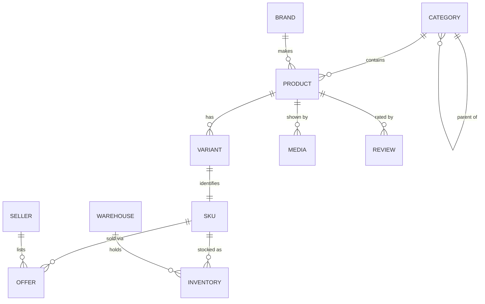

# Database Design

One PostgreSQL database per service ([ADR-0001](adr/0001-database-per-service.md)).
Schema is currently generated by Hibernate `ddl-auto: update`; migrating to Flyway is
[ADR-0003](adr/0003-schema-migrations.md).

## Databases

| Database | Owner | Host port |
|---|---|---|
| `order_service` | order-service | 5432 |
| `payment_service` | payment-service | 5433 |
| `inventory_service` | inventory-service | 5434 |
| `user_service` | user-service | 5435 |
| `item_service` | item-service | 5436 |
| `cart_service` | cart-service | 5437 |
| `checkout_service` | checkout-service | 5438 |
| `return_service` | return-service | 5439 |
| `logistics_service` | logistics-service | 5440 |
| `notification_service` | notification-service | 5441 |
| `admin_db` | admin-service | 5442 |
| `wishlist_service` | wishlist-service | 5443 |
| `seller_service` | seller-service | 5444 |
| `supplier_service` | supplier-service | 5445 |

Tables added for marketplace and dropship fulfilment — `courier_rules`,
`allocation_settings`, `dropship_partners`, `dropship_listings`, `supplier_orders`,
`supplier_order_lines`, and the new columns on `items`, `order_items`, `orders`,
`delivery_partners` and `shipments` — are specified in
[`commerce-architecture.md`](commerce-architecture.md) §13.

## Conventions

| Rule | Why |
|---|---|
| `BigDecimal` / `NUMERIC(19,4)` for money | Binary floating point cannot represent 0.1; rounding errors accumulate into real rupees |
| UUID primary keys for new tables | Sequential ids leak volume and invite enumeration. Existing tables keep `BIGSERIAL` |
| `created_at`, `updated_at`, `created_by`, `updated_by` | Audit and debugging |
| `version` for optimistic locking | Concurrent edits, especially inventory |
| Soft delete where history matters | Never hard-delete an order, payment or return |
| No cross-service foreign keys | A reference to another domain is a plain id column |
| Index every foreign key and every filtered column | Postgres does not index FKs automatically |

## Current schemas

Abbreviated to the fields that matter.

### `user_service`
```text
users
├── id BIGSERIAL PK
├── username UNIQUE NOT NULL      ├── email UNIQUE NOT NULL
├── password NOT NULL (BCrypt)    ├── first_name / last_name NOT NULL
├── role NOT NULL (ADMIN|CUSTOMER|GUEST)
├── phone_number / profile_picture_url
└── created_at (immutable) / updated_at

refresh_tokens
├── id PK / token UNIQUE / user_id FK
└── expires_at / revoked
```

### `item_service` — the main gap
```text
items
├── id BIGSERIAL PK / sku UNIQUE
├── name / description / price NUMERIC / quantity INT
├── item_type            ← a bare string, not a category reference
└── created_at / updated_at
```

No brand, category, images, variants, attributes or seller. Stock lives here **and**
in `inventory_service`, with nothing reconciling them. This is what Phase 2 replaces.

### `order_service` — the second gap
```text
orders
├── id BIGSERIAL PK / order_number UNIQUE
├── customer_id / status / total_amount NUMERIC
├── notes
└── created_at / updated_at

order_items
├── id PK / order_id FK
├── product_id / product_name  ← snapshot, correct
├── quantity / unit_price
└── description
```

Missing: `shipping_address_snapshot`, `billing_address_snapshot`,
`customer_snapshot`, `subtotal`, `discount`, `tax`, `shipping_fee`, `grand_total`,
`currency`, `payment_status`, `fulfillment_status`, `seller_id` on items, `version`.

The checkout UI collects a full address, posts it, and Jackson discards it — so every
order in the system is undeliverable. See [order-flow](flows/order-flow.md).

### `cart_service`
```text
carts        ├── id PK / user_id / item_count / status / timestamps
cart_items   ├── id PK / cart_id / item_id / item_name / quantity / price
```

`user_id` has no unique constraint, so a race can create two carts for one user.
`item_count` tracks lines, not units.

### `admin_db`
```text
admin_users  ├── id / username / email / password / role (SUPER_ADMIN|ADMIN|MODERATOR) / active
audit_logs   ├── id / admin_username / action / entity_type / entity_id / details / timestamp
```

Separate from `user_service.users` — see [ADR-0004](adr/0004-two-identity-realms.md).

## Target catalogue model

The single largest schema change ahead. Products are not SKUs.



- **Product** — the thing a customer reads about. Title, description, brand, category,
  specifications.
- **Variant** — a purchasable combination (128 GB / Black). Carries its own attributes.
- **SKU** — the stock-keeping unit. Unique. Inventory and pricing key on this.
- **Offer** — a seller's price and availability for a SKU. Marketplace needs many
  offers per SKU; first-party retail has one.

Price does **not** live on the product. `pricing-service` owns MRP, selling price,
effective dates and history, keyed by SKU.

## Inventory

Concurrency-safety is the whole problem. Reservation must be atomic:

```sql
UPDATE inventory
   SET available = available - :qty,
       reserved  = reserved  + :qty,
       version   = version + 1
 WHERE sku = :sku AND available >= :qty AND version = :version;
-- 0 rows updated ⇒ lost the race ⇒ reject, do not retry blindly
```

States: `available`, `reserved`, `allocated`, `damaged`, `in_transit`, `sold`,
`returned`. Reservations carry an expiry so an abandoned checkout returns stock.

## Indexes to add

| Table | Index | Why |
|---|---|---|
| `orders` | `(customer_id, created_at DESC)` | Order history — the most frequent customer query |
| `orders` | `(status)` | Admin active/closed lists |
| `order_items` | `(order_id)` | Loading an order |
| `cart_items` | `(cart_id)` | Every cart read |
| `carts` | `UNIQUE (user_id)` | Also fixes the duplicate-cart race |
| `items` | `(sku)` UNIQUE | Lookup |
| `refresh_tokens` | `(user_id)`, `(token)` | Refresh and revoke-all |
| `audit_logs` | `(entity_type, entity_id)`, `(timestamp DESC)` | Audit queries |
