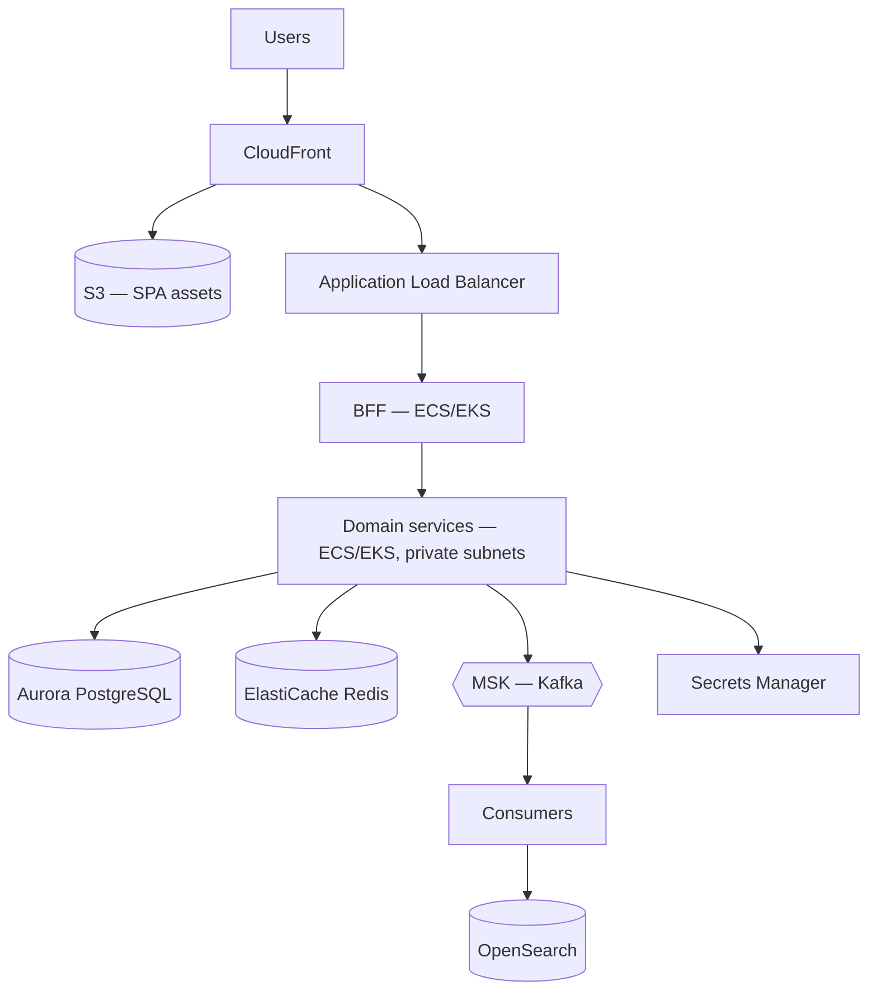

# Deployment

## Local — Docker Compose

Setup and troubleshooting: [`local-development.md`](local-development.md).

```bash
cp .env.example .env   # fill in the secrets
docker compose up --build
```

### Build model, and its trap

Every service Dockerfile is:

```dockerfile
FROM eclipse-temurin:21-jre
WORKDIR /app
COPY target/*.jar app.jar
ENTRYPOINT ["java", "-jar", "app.jar"]
```

There is **no Maven stage**. The jar must be built first, and a stale jar ships old
code with no warning — `logistics-service`'s jar is currently stale relative to its
source. Check with:

```bash
find <service>/src -name "*.java" -newer <service>/target/*.jar
```

CI must run `mvn package` before `docker build`. Better: add a builder stage so the
image cannot be built from a stale artifact —

```dockerfile
FROM maven:3.9-eclipse-temurin-21 AS build
WORKDIR /src
COPY pom.xml .
RUN mvn -q dependency:go-offline      # cached unless pom.xml changes
COPY src ./src
RUN mvn -q -DskipTests package

FROM eclipse-temurin:21-jre-alpine
WORKDIR /app
COPY --from=build /src/target/*.jar app.jar
ENTRYPOINT ["java","-jar","app.jar"]
```

Note: the root `.dockerignore` excludes `**/target/`, which would break the current
`COPY target/*.jar`. It has no effect today only because Docker reads `.dockerignore`
from the **build context** root (`./order-service/`, etc.) and none of those exist.
Adding per-service contexts later will break the builds unless this is fixed first.

### Compose notes

- Postgres services have healthchecks; app services use `depends_on: condition:
  service_healthy` for their database.
- Kafka is `condition: service_started` only — services must tolerate a broker that
  is not yet ready.
- `unified-ui` has `pull_policy: never`; it is always built locally.
- Secrets come from `.env` via `${JWT_SECRET:?...}`, which fails fast when unset.

## Production — AWS



### Non-negotiables

1. **Domain services live in private subnets.** Only the ALB is public, and only the
   BFF sits behind it. Several services trust anything that can reach them.
2. **Secrets come from Secrets Manager**, injected as environment variables. Never
   baked into an image, never in a file in the repo.
3. **TLS everywhere**, terminated at the ALB, with HSTS.
4. **Encryption at rest** on RDS, ElastiCache and S3.
5. **One database per service.** Separate Aurora clusters, or at minimum separate
   databases with separate credentials — a shared superuser defeats
   [ADR-0001](adr/0001-database-per-service.md).

### Migrations

Once [ADR-0003](adr/0003-schema-migrations.md) lands, Flyway runs at startup. With
rolling deploys, a migration must be compatible with the **previous** version for one
release:

```text
Release N:   add the column as nullable, backfill, write to both
Release N+1: read from the new column only
Release N+2: add NOT NULL, drop the old column
```

Never combine "add column" and "make it required" in one release.

### Scaling

| Component | Signal |
|---|---|
| BFF | Request rate / CPU |
| Catalogue & search | Read volume — scale hardest during traffic spikes |
| Checkout, payment, inventory | Order rate; these are the correctness-critical ones |
| Kafka consumers | Consumer lag, bounded by partition count |

Partition count caps consumer parallelism — choose it before launch; increasing it
later reshuffles keys and breaks per-aggregate ordering.

## CI/CD

```text
push → build → unit tests → static analysis → security scan → integration tests
     → docker build → container scan → push to ECR → deploy → smoke tests
```

Gates: any test failure, a new critical/high vulnerability, or a
non-backward-compatible migration blocks the pipeline.

Deploy the BFF and services independently. They are separately deployable by design —
[ADR-0001](adr/0001-database-per-service.md) — and coupling their releases discards
most of the benefit of the architecture.

## Pre-launch

See the checklist in [`security.md`](security.md#pre-production-checklist). The two
that are easiest to forget: internal service ports must not be reachable from the
internet, and CORS is currently wide open (`app.use(cors())`).
