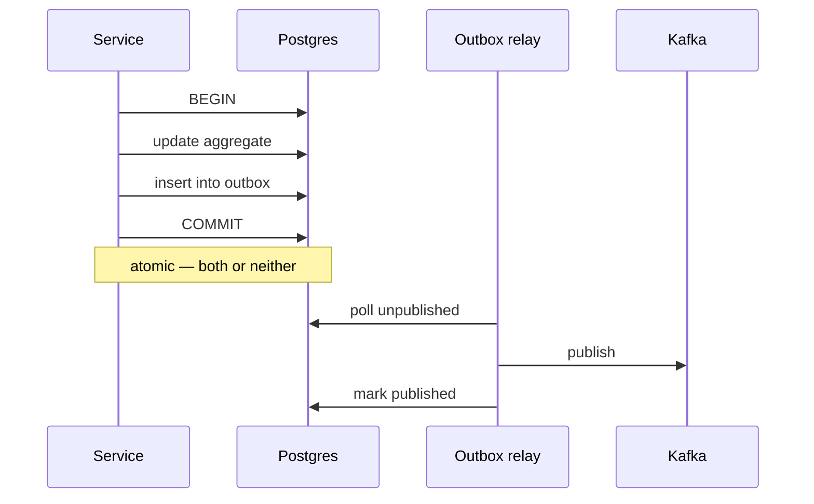

# Event Contracts

Kafka is wired into every service today (`SPRING_KAFKA_BOOTSTRAP_SERVERS`), but the
storefront flow completes without producing meaningful domain events — order creation
was observed to succeed with no consumer interaction. Treat everything below as the
**target contract**.

## Envelope

Every event carries the same envelope. The payload is domain-specific; the envelope
never changes shape.

```json
{
  "eventId": "9f1c2f6e-...",
  "eventType": "OrderCreated",
  "eventVersion": 1,
  "aggregateId": "order-3f8a...",
  "aggregateType": "Order",
  "correlationId": "req-7c21...",
  "causationId": "9a0b...",
  "occurredAt": "2026-09-08T12:00:00Z",
  "payload": { }
}
```

- `correlationId` — flows unchanged from the originating HTTP request through every
  downstream event. It is how one customer action is traced across services.
- `causationId` — the `eventId` that caused this one. `correlationId` groups; `causationId` orders.
- `eventVersion` — incremented on breaking payload changes.

## Topics

Named `<domain>.events`, keyed by `aggregateId` so a single aggregate's events stay
ordered within a partition.

| Topic | Producer | Consumers |
|---|---|---|
| `user.events` | user | notification, analytics |
| `product.events` | item | search, recommendation, analytics |
| `pricing.events` | pricing | search, cart, notification (price drop) |
| `cart.events` | cart | analytics, recommendation |
| `order.events` | order | payment, inventory, logistics, notification, analytics |
| `payment.events` | payment | order, notification, analytics |
| `inventory.events` | inventory | order, search, notification (back in stock) |
| `shipment.events` | logistics | order, notification |
| `return.events` | return | order, payment, inventory, notification |
| `review.events` | review | product, recommendation |
| `seller.events` | seller | admin, analytics |
| `notification.events` | notification | analytics |

## Event types

| Event | Payload (beyond the envelope) |
|---|---|
| `OrderCreated` | orderId, orderNumber, customerId, items[], grandTotal, currency |
| `OrderConfirmed` | orderId, confirmedAt |
| `OrderCancelled` | orderId, reason |
| `OrderShipped` | orderId, shipmentId, trackingNumber, carrier |
| `OrderDelivered` | orderId, deliveredAt |
| `PaymentRequested` | orderId, amount, method, idempotencyKey |
| `PaymentConfirmed` | orderId, paymentId, transactionRef, amount |
| `PaymentFailed` | orderId, reason, retryable |
| `RefundCompleted` | orderId, paymentId, amount |
| `InventoryReserved` | reservationId, orderId, items[] |
| `InventoryReleased` | reservationId, reason |
| `ProductUpdated` | productId, skus[], changedFields[] |
| `PriceChanged` | sku, oldPrice, newPrice, effectiveFrom |
| `ReturnApproved` | returnId, orderId, items[] |

## Versioning

Additive changes (a new optional field) keep the version. Anything a consumer could
break on — removing a field, changing a type, changing semantics — increments it.

Publish both versions during a migration:

```text
order.created.v1   ← old consumers
order.created.v2   ← new consumers
```

Retire v1 only once every consumer group has moved.

## Reliability

### Outbox

Never publish to Kafka inside a database transaction and hope both commit. Write the
event to an `outbox` table in the **same** transaction as the state change; a relay
publishes it afterwards.



This yields at-least-once delivery, which is why consumers must be idempotent.

### Idempotent consumers

Every consumer records processed `eventId`s and skips duplicates. A redelivered
`PaymentConfirmed` must not confirm an order twice.

### Retry and DLQ

Retry with exponential backoff (1s, 2s, 4s, 8s, 16s), then route to
`<topic>.DLT`. DLQ depth is an alertable metric — a silently filling DLQ is a
production incident nobody notices.

Do **not** retry deterministic failures (malformed payload, unknown enum). Those go
straight to the DLQ; retrying cannot help.

## Rules

1. Events describe **what happened**, in the past tense. Not commands.
2. An event carries what a consumer needs; it does not force a callback for the basics.
3. Never publish a secret, password, token, or full card number.
4. Key by `aggregateId` for per-aggregate ordering. Do not assume global ordering.
5. Kafka is not a database. It is not the source of truth for state.
6. A consumer failing must not block its producer.
