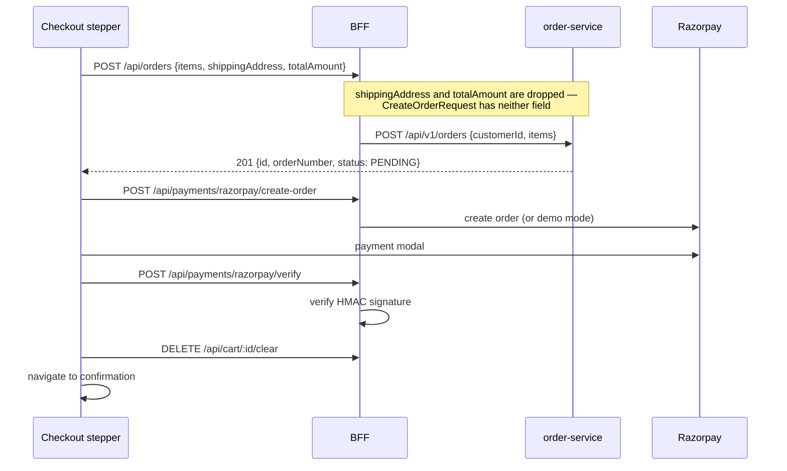
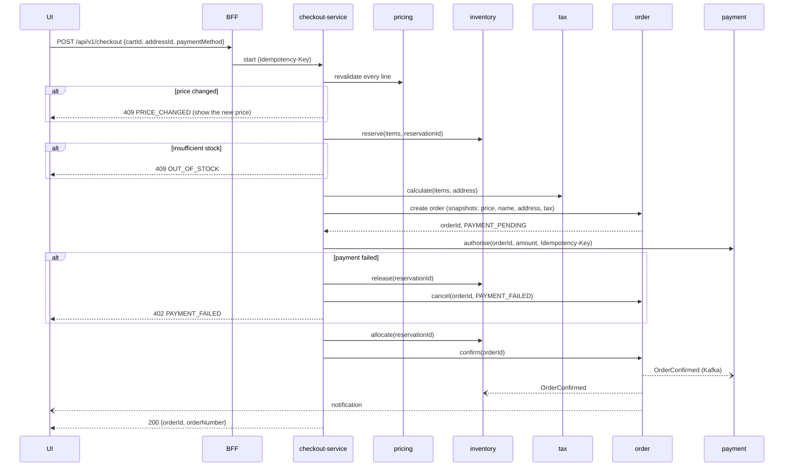

# Checkout Flow

## Today

Checkout is a sequence of BFF calls with **no compensation**. If a step fails after an
earlier one succeeded, the earlier effect stays.

### Known problems

1. **No inventory reservation.** Nothing decrements or holds stock. Two customers can
   buy the last unit.
2. **The shipping address is discarded** (`CODE_REVIEW.md` §2.3). Orders are
   undeliverable.
3. **No compensation.** If payment fails, the `PENDING` order stays forever.
4. **Payment does not update order status.** A paid order stays `PENDING`.
5. **No tax or shipping calculation.** The total is the sum of line prices.
6. **The client's `totalAmount` is ignored** — correct, order-service recomputes from
   line items — but nothing validates the two agree, so a price change between cart
   and checkout is silent.

## Target

A saga with explicit compensation, orchestrated by `checkout-service`.

### Compensation

| Failed step | Compensation |
|---|---|
| Price validation | none — nothing reserved yet |
| Inventory reservation | none |
| Tax | release reservation |
| Order creation | release reservation |
| Payment authorisation | release reservation, cancel order `PAYMENT_FAILED` |
| Inventory allocation | void/refund payment, cancel order |

### Rules

- **Reservations expire.** A reservation holds stock for a bounded window (15 minutes)
  and is swept if the saga dies mid-flight. Without expiry, an abandoned checkout
  removes stock permanently.
- **Idempotency.** The client generates one `Idempotency-Key` per checkout attempt.
  Replaying it returns the original result rather than creating a second order or
  charging twice.
- **Prices are revalidated server-side** against `pricing-service`, never taken from
  the cart, which may be days old.
- **Snapshots are written at order creation**, not resolved later.

## Failure modes to test

| Scenario | Expected |
|---|---|
| Price changed between cart and checkout | 409, cart updated, nothing reserved |
| Stock exhausted mid-checkout | 409, no order created |
| Payment gateway times out | Reservation released, order `PAYMENT_FAILED`, no charge |
| Payment succeeds, allocation fails | Refund issued, order cancelled, customer notified |
| Customer submits twice (double-click) | One order, one charge |
| Saga process dies after reserving | Reservation expires, stock returns |
