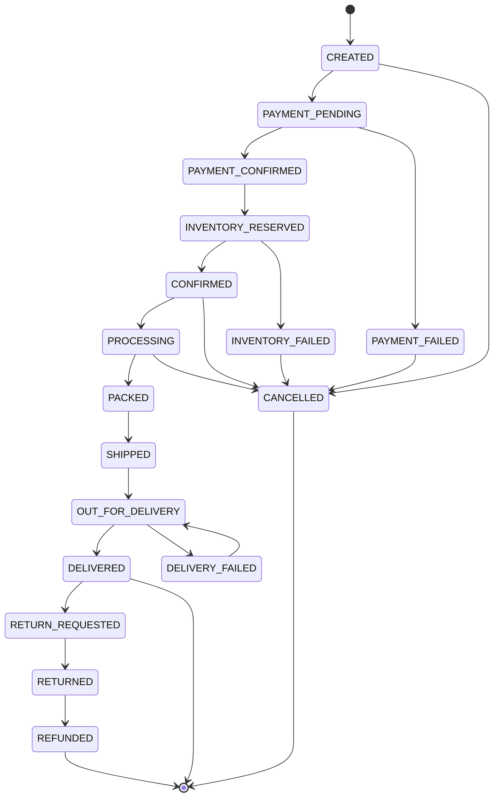
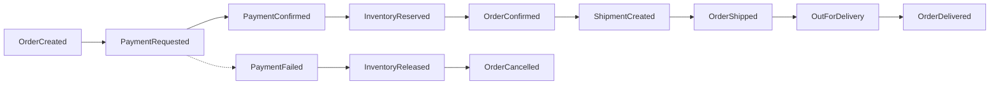

# Order Lifecycle

## Today

`OrderStatus` in order-service, with `PENDING` as the effective terminal state — no
part of the running system advances an order past it automatically. Only an
administrator moves it, via `PUT /api/orders/:id/status`.

## Target lifecycle



Transitions are enforced in the domain, not the UI. An illegal transition is a 409
with `INVALID_ORDER_TRANSITION`, never a silent no-op.

Cancellation is only allowed before `PACKED`. After that the customer goes through
returns.

## Data model

The critical property: **an order must render identically in five years, after the
product has been renamed, repriced, or deleted.** That means snapshots, never joins to
live records.

```text
orders
├── id                          UUID
├── order_number                human-facing, e.g. ORD-6A66F4D6
├── customer_id
├── status
├── subtotal / discount / tax / shipping_fee / grand_total   BigDecimal
├── currency
├── payment_status
├── fulfillment_status
├── shipping_address_snapshot   JSONB  ← missing today
├── billing_address_snapshot    JSONB  ← missing today
├── customer_snapshot           JSONB  (name, email, phone at time of order)
├── version                     optimistic locking
└── created_at / updated_at

order_items
├── id / order_id
├── product_id / sku / seller_id
├── product_name_snapshot       ← name at time of order
├── unit_price / quantity / tax / discount / total
└── (no FK to the live product)
```

### Gap today

`CreateOrderRequest` accepts only `customerId`, `items`, `notes`. The checkout UI
collects and validates a full Indian address (6-digit PIN, `[6-9]`-prefixed mobile),
posts it, and Jackson silently drops it. Verified: creating an order with a full
`shippingAddress` returns a 201 whose body contains no address anywhere.

Closing this is the first schema change of the order rework. It needs
`shipping_address_snapshot`, `billing_address_snapshot`, `tax`, `shipping_fee` and
`grand_total` on `orders`, plus the `CreateOrderRequest` fields to populate them.

## Events



Consumers per event are listed in [`../event-contracts.md`](../event-contracts.md).

## Rules

1. **Snapshots, not joins.** Order history never reads the live product table.
2. **Money is `BigDecimal`.** `grand_total = subtotal - discount + tax + shipping_fee`,
   asserted at write time.
3. **Order creation is idempotent** on `Idempotency-Key`; a replay returns the
   original order.
4. **Transitions are validated** against the state machine above.
5. **Every status change is audited** with actor, timestamp and reason.
6. **`order_number` is the customer-facing id**; the UUID never appears in the UI or
   in an email.
