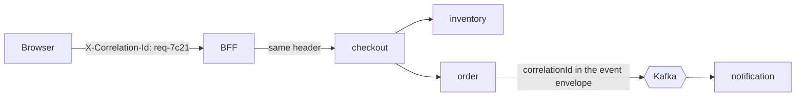

# Observability

## Current state

Spring Boot Actuator with `health,info,metrics` exposed and `show-details: always`.
The BFF has `GET /health`. Logging is Spring's default console format.

That is enough to see whether a container is up and nothing else. Several defects
found in review — the top-products call 404ing, the dashboard silently falling back —
were invisible because the failure was caught and swallowed with no signal.

## Correlation ids

The single highest-value addition. One customer action crosses the BFF and several
services; without a shared id the logs cannot be joined.



Rules:

- The BFF generates one per request if the client did not send it.
- Every outbound call forwards it. Every log line includes it.
- It goes into the Kafka envelope
  ([event-contracts](event-contracts.md#envelope)) so async work stays traceable.
- It is returned to the client in the response body and header, so a support ticket
  quoting it can be traced directly.

Implement with a servlet filter putting it in the MDC, and an Express middleware plus
an axios interceptor on the BFF side.

## Logging

Structured JSON in production, human-readable locally.

```json
{"timestamp":"2026-09-08T12:00:00Z","level":"INFO","service":"order-service",
 "correlationId":"req-7c21","userId":"6","event":"OrderCreated",
 "orderId":"3f8a","message":"Order created"}
```

- **Never log** passwords, tokens, card numbers, CVV, or full addresses.
- **Do not swallow errors.** `catch (e) { /* ignore */ }` is how a 404 stayed invisible
  for months. Log at `WARN` with the correlation id, even when falling back.
- `INFO` for state changes, `WARN` for degraded-but-handled, `ERROR` for a failed
  request. Not everything is `INFO`.

## Metrics

Micrometer → Prometheus → Grafana.

**RED per service:** request rate, error rate, duration (p50/p95/p99).

**Business metrics that reveal breakage no health check will:**

| Metric | Why |
|---|---|
| Orders created per minute | A drop to zero is an outage the health check will not show |
| Checkout conversion by step | Where customers fall out |
| Payment success rate | Gateway trouble |
| Cart abandonment | |
| Inventory reservation failures | Overselling pressure |
| Search latency and zero-result rate | |
| DLQ depth per topic | A filling DLQ is an incident nobody notices |
| Outbox lag | Events written but not published |

## Tracing

OpenTelemetry, exported to Jaeger locally and X-Ray or Tempo in production. Trace the
checkout saga end to end — it is the flow where a single slow downstream call is
otherwise impossible to attribute.

Span attributes: `service.name`, `http.route`, `correlation.id`, `order.id`,
`customer.id`. Never put PII in a span.

## Health checks

Distinguish the two, or Kubernetes will restart healthy pods:

| Probe | Question | Fails when |
|---|---|---|
| Liveness | Is the process wedged? | Deadlock, OOM — restart helps |
| Readiness | Can it serve traffic? | Database down, Kafka unreachable — restart does not help |

A dependency being down is a **readiness** failure. `/actuator/health` with
`show-details: always` leaks internal topology and must be restricted in production.

## Alerts

Alert on symptoms customers feel, not on causes.

| Alert | Condition |
|---|---|
| Checkout failure rate | > 5% over 5 min |
| Order rate collapse | Orders/min < 20% of the 7-day baseline |
| Payment success rate | < 95% over 10 min |
| API p99 latency | > 2 s over 5 min |
| DLQ depth | > 0 for 15 min |
| Outbox lag | > 1000 unpublished |
| 5xx rate | > 1% over 5 min |

Do not alert on CPU. Alert on "customers cannot check out".

## Implementation order

1. Correlation ids end to end — everything else is more useful with them.
2. Structured JSON logging with the correlation id in the MDC.
3. RED metrics and the business metrics above.
4. Readiness/liveness split.
5. Distributed tracing.
6. Alerts and dashboards.
