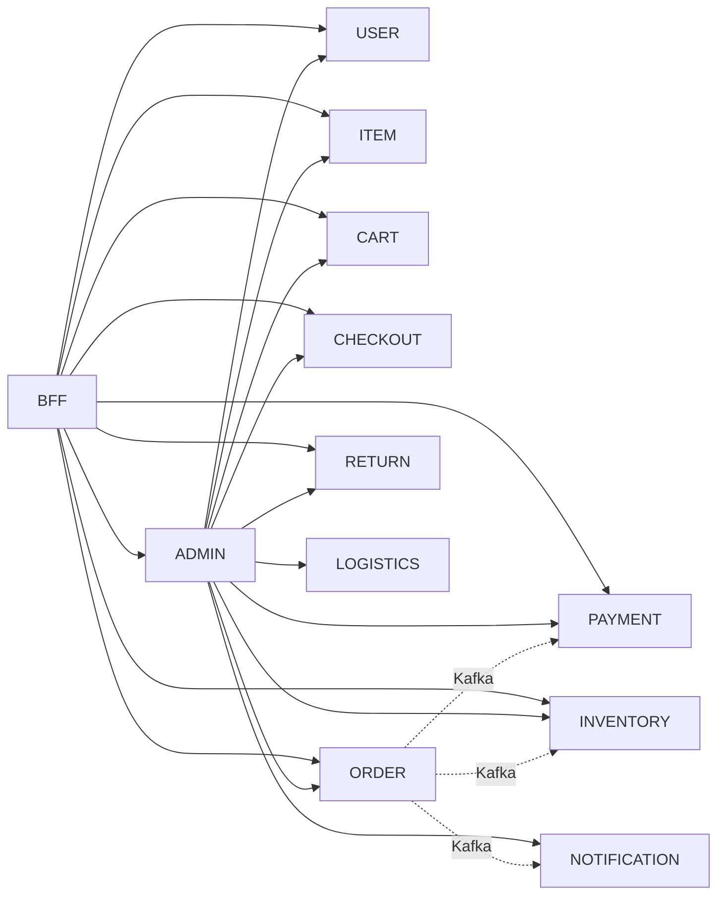

# Service Catalog

Status is **verified against the running stack**, not aspirational.

- `built` — runs, has real endpoints, exercised end-to-end
- `partial` — runs, but a core capability is missing or broken (see notes)
- `planned` — specified, no code

## Existing services

| Service | Port | DB (host port) | Status | Owns |
|---|---|---|---|---|
| unified-ui | 4200 | — | built | Angular SPA + Express BFF; auth, proxying, role routing |
| order-service | 8001 | order_service (5432) | partial | Order lifecycle. **No address, tax or shipping fields** |
| payment-service | 8002 | payment_service (5433) | partial | Payments, refunds. Razorpay lives in the BFF, not here |
| inventory-service | 8003 | inventory_service (5434) | partial | Stock by SKU, reserve/release. Concurrency safety unverified |
| user-service | 8004 | user_service (5435) | built | Customers, roles, auth, refresh tokens. Redis-backed blacklist |
| item-service | 8005 | item_service (5436) | partial | Flat catalogue. **No variants, brand, category, images** |
| cart-service | 8006 | cart_service (5437) | built | Carts and cart items |
| checkout-service | 8007 | checkout_service (5438) | partial | Checkout records. Not a saga orchestrator |
| return-service | 8008 | return_service (5439) | built | Return requests, approve/reject/refund |
| logistics-service | 8009→8088 | logistics_service (5440) | partial | Shipments. **Jar is stale vs source** |
| notification-service | 8010 | notification_service (5441) | partial | Kafka consumer. No real email/SMS transport |
| admin-service | 8011 | admin_db (5442) | built | Admin users, management proxy, audit log, dashboard analytics |

### Notes on `partial`

- **order-service** — `CreateOrderRequest` has only `customerId`, `items`, `notes`.
  The checkout UI collects a full shipping address and it is silently discarded
  (`CODE_REVIEW.md` §2.3). No `/api/v1/orders/top-products`, so the admin
  top-products table is empty (§2.10).
- **item-service** — `ItemResponse` is `id, sku, name, description, price, quantity,
  itemType, createdAt, updatedAt`. No image or category field, which is why the
  storefront falls back to random stock photography (§3.4).
- **logistics-service** — eight source files are newer than the packaged jar. Run
  `mvn package` before trusting its behaviour.
- **checkout-service** — persists a checkout row; it does not orchestrate
  inventory/payment/order with compensation.

## Planned services

Ports are reserved. None of these exist.

| Service | Port | Phase | Responsibility |
|---|---|---|---|
| category-service | 8012 | 2 | Category tree, attributes, taxonomy |
| search-service | 8013 | 3 | OpenSearch indexing and query |
| pricing-service | 8014 | 4 | MRP, selling price, effective dates, price history |
| promotion-service | 8015 | 4 | Coupons, offers, usage limits |
| wishlist-service | 8016 | 5 | Wishlists, price-drop and back-in-stock triggers |
| address-service | 8017 | 5 | Customer address book |
| warehouse-service | 8018 | 10 | Warehouses, picking, packing, transfers |
| review-service | 8019 | 12 | Ratings, reviews, verified purchase |
| recommendation-service | 8020 | 15 | Rule-based, ML-ready |
| seller-service | 8021 | 13 | Seller onboarding, KYC, settlement |
| support-service | 8022 | — | Tickets |
| tax-service | 8023 | 6 | GST / CGST / SGST / IGST, HSN |
| fraud-service | 8024 | 16 | Risk checks at checkout |
| media-service | 8025 | 2 | Product images, video, documents |
| analytics-service | 8026 | 16 | Business and customer analytics |

## Infrastructure

| Component | Port | Notes |
|---|---|---|
| Kafka | 9092 | KRaft, single node |
| Kafka UI | 8080 | Local only |
| Redis | 6379 | user-service sessions and token blacklist |
| pgAdmin | 5050 | `admin@example.com` / `admin` — local only |
| OpenSearch | 9200 | planned |

## Dependencies

`admin-service` fans out to every other service over REST — it is the widest
dependency in the system and the most likely source of cascading timeouts. It applies
a per-call timeout (`dashboard.downstream-timeout-ms`, default 4000 ms) with per-service
fallbacks and surfaces failures as `warnings` on the dashboard summary.

## Adding a service

1. Add a row here with status `planned` before writing code.
2. Reserve a port (next free in the 80xx range) and a database.
3. Copy an existing service's `pom.xml` and `Dockerfile`.
4. Register it in `docker-compose.yml` with its own Postgres and a healthcheck.
5. Document its API in [`api-contracts.md`](api-contracts.md) and its events in
   [`event-contracts.md`](event-contracts.md).
6. Expose it through the BFF — never directly to the browser.
